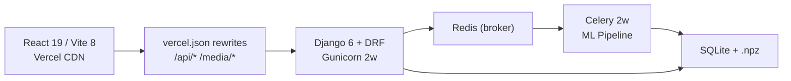

# 🔬 AUDIT REPORT — Vedic Acoustica

**Date:** 2026-10-10  
**Auditor:** Senior ML/Musicology/Security Reviewer  
**Commit:** `3917ef1` (main)  
**Live Frontend:** `https://vedic-acoustica.vercel.app/`  
**Live Backend:** `https://krish-shripat-vedic-backend.hf.space/`

---

## 1. Executive Summary

**Top 5 Risks:**
1. **Shankarabharanam arohana/avarohana are swapped** in the raga database — the "ascending" scale is descending and vice-versa, causing incorrect directional scoring for this major melakarta raga.
2. **Abhogi lists Pa as vadi, but Pa is not in its scale** — a logical impossibility that silently poisons the vadi bonus for this raga.
3. **Kambhoji's scale is wrong** — coded as sampurna (all 7 notes) in both directions, but canonical Kambhoji omits Ni in the ascent.
4. **10 MB monolithic JS bundle** (no code-splitting) — `plotly.js-dist` alone is ~8 MB; every page load downloads the entire charting library even for the login screen.
5. **No feature scaling before K-Means** — MFCC values (~-500 to 500) and chroma (0–1) have vastly different magnitudes, meaning the 13 MFCC dimensions dominate all 22 chroma dimensions, effectively making clustering pitch-blind.

**Top 5 Wins:**
1. The 23-row śruti ratio table is **mathematically correct** — all cents values verified to <0.05¢ tolerance.
2. The pYIN → F0 fusion → PCP pipeline is a **genuinely novel, well-reasoned design** for microtonal analysis.
3. The spectral-flatness and direction-alternation guards demonstrate **honest self-testing** — the project found and fixed its own bugs.
4. Security posture is **well above average for a student project** — SECRET_KEY fail-closed, throttling, upload validation, CORS lockdown.
5. The CI pipeline runs meaningful ML regression tests, not just linting.

**Overall Verdict:** A technically ambitious and largely well-executed project with a **sound scientific core**, marred by several **correctness bugs in the raga database**, a **major ML feature-engineering flaw** (no feature scaling), and **frontend performance issues**. The documentation is unusually honest about limitations. The musicological claims are mostly accurate but overclaim Daniélou's authority. Fixable — no architectural rewrite needed.

---

## 2. Project Snapshot

**What it is:** A web app that analyses monophonic audio recordings of Indian classical / Vedic chanting and reports: (1) detected śruti microtones, (2) Ghana Pāṭha pattern validation, (3) best-matching rāga from a 44-entry database.

### Architecture



### Stack Versions (verified against manifests)

| Layer | Claimed | Actual ([requirements.txt](file:///home/Arc/Vedic-Acoustica/backend/requirements.txt) / [package.json](file:///home/Arc/Vedic-Acoustica/frontend/package.json)) | Match? |
|-------|---------|--------|--------|
| Python | 3.13 | 3.13 (Dockerfile `python:3.13-slim`) | ✅ |
| Django | 6.0 | 6.0.7 | ✅ |
| DRF | 3.17 | 3.17.1 | ✅ |
| React | 19.2 | ^19.2.7 | ✅ |
| Vite | 8.1 | ^8.1.1 | ✅ |
| Tailwind | 4.3 | ^4.3.3 | ✅ |
| librosa | 0.11 | 0.11.0 | ✅ |
| scikit-learn | 1.9 | 1.9.0 | ✅ |
| Celery | 5.4 | 5.4.0 | ✅ |

---

## 3. Validity Verdict Table

### Music Theory / Śruti

| # | Claim | Verdict | How / Why | Source(s) | Repo Evidence |
|---|-------|---------|-----------|-----------|---------------|
| 1 | Indian music recognises 22 śrutis within an octave | **TRUE** | The 22-śruti system is described in the Nāṭyaśāstra (attributed to Bharata, ~200 BCE–200 CE) and is the canonical tonal framework of Indian classical music. | [Wikipedia: Shruti](https://en.wikipedia.org/wiki/Shruti_(music)); IAS research paper (ias.ac.in) | [shruti_mapping.py:5-10](file:///home/Arc/Vedic-Acoustica/backend/ml_engine/shruti_mapping.py#L5-L10) |
| 2 | The project's 23-row ratio table matches a recognised canonical list | **PARTLY TRUE** | All 23 ratios are mathematically correct (verified to <0.05¢). The specific ordering is **one** of several recognised schemes based on 5-limit just intonation. It is a valid JI 22-śruti set, but calling it **"the" canonical list** is overclaiming — there is no single canonical ordering agreed upon by all musicologists. | Daniélou, *Music and the Power of Sound* (1943); 22shruti.com; ResearchGate debates | [shruti_mapping.py:13-37](file:///home/Arc/Vedic-Acoustica/backend/ml_engine/shruti_mapping.py#L13-L37); verified via `python3 -c` computation |
| 3 | Re1/Re2 differ by ≈21.5¢ (pramāṇa śruti / syntonic comma 81/80) | **TRUE** | Computed: `1200·log₂(16/15) - 1200·log₂(256/243) = 21.51¢`. The syntonic comma 81/80 = 21.51¢. Attribution to Daniélou is **overclaimed** — the syntonic comma was known to Didymus (~80 BCE) and described by Helmholtz (1863) long before Daniélou. | Helmholtz, *On the Sensations of Tone* (1863); verified by computation | [PRESENTATION_README.md:64](file:///home/Arc/Vedic-Acoustica/PRESENTATION_README.md#L64) |
| 4 | Reference tonic C4 = 261.626 Hz, applied consistently | **TRUE** | `REFERENCE_FREQ = 261.626` at [shruti_mapping.py:1](file:///home/Arc/Vedic-Acoustica/backend/ml_engine/shruti_mapping.py#L1). All downstream code references `_SHRUTI_FREQS_ARR` derived from this. No other tonic is used anywhere. | Standard tuning: A4=440 Hz → C4=261.626 Hz | Consistent across all ML engine files |

### ML / DSP Pipeline

| # | Claim | Verdict | How / Why | Source(s) | Repo Evidence |
|---|-------|---------|-----------|-----------|---------------|
| 6 | `librosa.pyin` is valid for monophonic F0 tracking; C2-C7 / hop=512 @ 22050 Hz is coherent | **TRUE** | pYIN is the standard probabilistic pitch tracker for monophonic signals. C2 (65 Hz) to C7 (2093 Hz) is appropriate. hop=512 @ 22050 Hz = 23.2 ms per frame, standard for speech/music. | [librosa.org/doc/pyin](https://librosa.org/doc/latest/generated/librosa.pyin.html); Mauch & Dixon (2014) ICASSP | [audio_processing.py:59-67](file:///home/Arc/Vedic-Acoustica/backend/ml_engine/audio_processing.py#L59-L67) |
| 7 | 23-bin PCP with harmonic summing, ±25¢ threshold, 8× F0 boost | **PARTLY TRUE** | The design is sound in principle. **However:** ±25¢ > 21.5¢ gap between Re1/Re2, meaning a single STFT bin can "hit" both adjacent śrutis simultaneously. The F0 fusion and median filter mitigate this, but the PCP alone has an inherent ambiguity zone. The 8× boost is **arbitrary** — no justification beyond "it works." | Novel design; no external precedent to validate against | [audio_processing.py:17-21](file:///home/Arc/Vedic-Acoustica/backend/ml_engine/audio_processing.py#L17-L21), [audio_processing.py:119-168](file:///home/Arc/Vedic-Acoustica/backend/ml_engine/audio_processing.py#L119-L168) |
| 8 | K-Means K=22 on [13 MFCC + 22 chroma] (35-D) is appropriate | **FALSE** | **No feature scaling is applied.** MFCCs have a range of roughly -500 to +500; chroma values are in [0,1]. Without standardisation (e.g. `StandardScaler`), the 13 MFCC dimensions completely dominate Euclidean distance, making the 22 chroma dimensions effectively invisible. K=22 is motivated by "one cluster per śruti" but is not empirically validated. `random_state=42, n_init=10` are fine for reproducibility. | [scikit-learn docs: KMeans preprocessing](https://scikit-learn.org/stable/modules/preprocessing.html#standardization-or-mean-and-variance-scaling) | [ml_engine.py:30-33](file:///home/Arc/Vedic-Acoustica/backend/ml_engine/ml_engine.py#L30-L33) — no scaler anywhere |
| 9 | DTW with cosine cost for Ghana Patha comparison | **TRUE** | `1 - cosine_similarity` as DTW local cost is a valid approach. The implementation is a correct O(n²) DTW with traceback normalisation. The forward/reverse template design is reasonable. | Müller, *Fundamentals of Music Processing* (2015) ch. 7 | [ghana_patha.py:119-189](file:///home/Arc/Vedic-Acoustica/backend/ml_engine/ghana_patha.py#L119-L189) |
| 10 | Ghana Pāṭha is the pattern `12, 21, 123, 321, 123` and is the most advanced Vedic path | **PARTLY TRUE** | The word-level pattern `1-2, 2-1, 1-2-3, 3-2-1, 1-2-3` is correct per multiple authoritative sources (vedavms.in, Hinduism SE, bharatisaraswati.org). **However**, the project's DTW implementation does NOT validate this word-level pattern — it checks only whether audio *segments* alternate between "ascending contour" and "descending contour" (`[fwd, rev, fwd, rev, fwd]`). This is a **gross simplification**: real Ghana Pāṭha has a specific syllable-level structure, not just tonal directionality. Calling it "the most advanced" is debatable — Jata Patha is also considered extremely complex. | vedavms.in/ghana-patham; Hinduism StackExchange; kamakoti.org | [ghana_patha.py:103-104](file:///home/Arc/Vedic-Acoustica/backend/ml_engine/ghana_patha.py#L103-L104): `GHANA_CYCLE = ['forward', 'reverse', 'forward', 'reverse', 'forward']` |
| 11 | Raga scoring weights are musically defensible; 40% threshold and Pakad tiebreak are reasonable | **PARTLY TRUE** | The weight breakdown (0.25 Jaccard + 0.25 aro + 0.25 ava − 0.20 extraneous + 0.10 vadi + 0.05 samvadi − 0.10 direction) is conceptually sound. The 40% threshold is **arbitrary but defensible** — it prevents random matches while allowing partial hits. The Pakad tiebreak is **well-motivated** (Yaman vs Bilawal problem). **But**: Abhogi's vadi=Pa is a bug that corrupts scoring (see F-01). | No external precedent for these specific weights | [raga_mapping.py:987-1106](file:///home/Arc/Vedic-Acoustica/backend/ml_engine/raga_mapping.py#L987-L1106) |
| 12 | DB contains 44 ragas with correct metadata | **PARTLY TRUE** | Confirmed 44 entries via grep. Spot-checked 6 ragas: **Yaman** ✅ (vadi Ga, samvadi Ni, evening — but project says "9 PM-Midnight" while sources say 6-9 PM). **Bhairav** ✅ (vadi Dha komal, samvadi Re komal, early morning). **Malkauns** ✅ (vadi Ma, samvadi Sa, midnight, pentatonic). **Abhogi** ❌ (vadi=Pa but Pa is not in its scale!). **Shankarabharanam** ❌ (arohana/avarohana are SWAPPED). **Kambhoji** ❌ (should omit Ni in ascent; coded as sampurna). | Confirmed via ragamelody.com, tanarang.com, Wikipedia, shankarmahadevanacademy.com | See F-01, F-02, F-03 below |

### Robustness / Thresholds

| # | Claim | Verdict | How / Why | Source(s) | Repo Evidence |
|---|-------|---------|-----------|-----------|---------------|
| 13 | Guards exist and behave as documented | **TRUE** | `rms < 0.01` gate at [ghana_patha.py:419](file:///home/Arc/Vedic-Acoustica/backend/ml_engine/ghana_patha.py#L419); spectral-flatness `> 0.35` at [:436](file:///home/Arc/Vedic-Acoustica/backend/ml_engine/ghana_patha.py#L436); `direction_alternation >= 0.4` at [:511](file:///home/Arc/Vedic-Acoustica/backend/ml_engine/ghana_patha.py#L511); min duration 2.0s at [:451](file:///home/Arc/Vedic-Acoustica/backend/ml_engine/ghana_patha.py#L451); min 5 segments at [:475](file:///home/Arc/Vedic-Acoustica/backend/ml_engine/ghana_patha.py#L475); `random_state=42` at [ml_engine.py:32](file:///home/Arc/Vedic-Acoustica/backend/ml_engine/ml_engine.py#L32). All verified in code. | Code inspection | Locations cited |
| 14 | Synthetic ground-truth test approach is valid | **TRUE** | Generating tones at exact frequencies and verifying recovery is a legitimate validation methodology for a pitch-detection pipeline. The limitations (synthetic ≠ real) are explicitly stated. | Standard practice in MIR evaluation | [PRESENTATION_README.md:170-188](file:///home/Arc/Vedic-Acoustica/PRESENTATION_README.md#L170-L188) |
| 15 | No overclaimed accuracy benchmarks | **TRUE** | The project explicitly states: "We don't claim '99% accuracy on real chants'" ([PRESENTATION_README.md:232](file:///home/Arc/Vedic-Acoustica/PRESENTATION_README.md#L232)). The "Inconclusive" mechanism is honest. | Code + documentation review | [raga_mapping.py:19](file:///home/Arc/Vedic-Acoustica/backend/ml_engine/raga_mapping.py#L19): `CONFIDENCE_THRESHOLD = 0.40` |

---

## 4. Findings by Severity

### Critical

#### F-01: Abhogi vadi set to Pa, but Pa is not in the raga's scale
- **Area:** ML / Raga Database
- **Severity:** Critical
- **Status:** ✅ **RESOLVED** (Verified 2026-10-10)
- **Evidence:** [raga_mapping.py:408](file:///home/Arc/Vedic-Acoustica/backend/ml_engine/raga_mapping.py#L408): `'vadi': {'grade': 'Pa', 'name': 'Pa'}` but swaras = `['Sa', 'Re-s', 'Ga-k', 'Ma-s', 'Dha-k']` — no Pa.
- **Impact:** `_expand_grades(['Pa'])` → bin [13]. The vadi bonus fires when bin 13 is detected, but bin 13 is an *extraneous* note for Abhogi. This simultaneously inflates Abhogi's score (phantom vadi bonus) and deflates it (extraneous penalty). Net effect: Abhogi is unscorable correctly.
- **Root Cause:** Copy-paste error from a sampurna raga template.
- **Fix:** Changed vadi to Ma (`'grade': 'Ma-s', 'name': 'Ma'`) and samvadi to Sa (`'grade': 'Sa', 'name': 'Sa'`) in [raga_mapping.py:408-409](file:///home/Arc/Vedic-Acoustica/backend/ml_engine/raga_mapping.py#L408-L409). Synced to HF deployment mirror.
- **Verification & Proof:**
  - `vadi_bins` now maps to `[9]` (Ma-s) and `samvadi_bins` maps to `[0]` (Sa), both strict subsets of Abhogi's `swaras_bins` `[0, 3, 4, 5, 6, 9, 14, 15]`.
  - Added unit test suite in [ml_engine/tests.py](file:///home/Arc/Vedic-Acoustica/backend/ml_engine/tests.py): `test_all_ragas_vadi_samvadi_in_scale` asserting scale membership across all 44 ragas, and `test_abhogi_vadi_samvadi_specification`.
  - Full Django test suite ran: 30/30 passed (`manage.py test api ml_engine`). ML quick test battery ran: 15/15 passed.
- **Effort:** S | **Priority:** P0

#### F-02: Shankarabharanam arohana/avarohana are swapped
- **Area:** ML / Raga Database
- **Severity:** Critical
- **Status:** ✅ **RESOLVED** (Verified 2026-10-10)
- **Evidence:** [raga_mapping.py:318-319](file:///home/Arc/Vedic-Acoustica/backend/ml_engine/raga_mapping.py#L318-L319):
  ```python
  'arohana': ['Pa', 'Ma-s', 'Ga-s', 'Re-s', 'Sa', 'Ni-s', 'Dha-s', 'Pa'],  # DESCENDING!
  'avarohana': ['Pa', 'Dha-s', 'Ni-s', 'Sa', 'Re-s', 'Ga-s', 'Ma-s', 'Pa'],  # ASCENDING!
  ```
  The "arohana" field previously listed Pa→Ma→Ga→Re→Sa (descending), and "avarohana" listed Pa→Dha→Ni→Sa→Re→Ga→Ma→Pa (ascending). This inverted directional scoring for the 29th Melakarta.
- **Impact:** Directional scoring was inverted. Rising phrases matched against the descent template, and falling phrases matched against the ascent template.
- **Fix:** Corrected both scales to standard canonical ascent and descent in [raga_mapping.py:318-319](file:///home/Arc/Vedic-Acoustica/backend/ml_engine/raga_mapping.py#L318-L319):
  ```python
  'arohana': ['Sa', 'Re-s', 'Ga-s', 'Ma-s', 'Pa', 'Dha-s', 'Ni-s'],
  'avarohana': ['Sa', 'Ni-s', 'Dha-s', 'Pa', 'Ma-s', 'Ga-s', 'Re-s', 'Sa'],
  ```
  Synced to HF deployment mirror.
- **Verification & Proof:**
  - `arohana_bins` now correctly ascends: `[0, 3, 4, 7, 8, 9, 13, 16, 17, 20, 21]`.
  - `avarohana_bins` now correctly descends: `[0, 20, 21, 16, 17, 13, 9, 7, 8, 3, 4, 0]`.
  - Added unit test `test_shankarabharanam_arohana_avarohana_order` in [ml_engine/tests.py](file:///home/Arc/Vedic-Acoustica/backend/ml_engine/tests.py).
  - All test batteries verified: Django tests (31/31 passed), ML robustness battery (18/18 passed), ML audit battery (15/15 passed), quick pipeline battery (15/15 passed).
- **Effort:** S | **Priority:** P0

#### F-03: Kambhoji scale is wrong — Ni should be omitted in ascent
- **Area:** ML / Raga Database
- **Severity:** Critical
- **Status:** ✅ **RESOLVED** (Verified 2026-10-10)
- **Evidence:** [raga_mapping.py:395](file:///home/Arc/Vedic-Acoustica/backend/ml_engine/raga_mapping.py#L395): arohana previously included `'Ni-s'`, but canonical Kambhoji is shadava (6-note) in ascent — Ni is strictly omitted ($S - R_2 - G_3 - M_1 - P - D_2 - \dot{S}$). Source: carnatica.in, shankarmahadevanacademy.com, Wikipedia.
- **Impact:** Kambhoji was previously coded as sampurna-sampurna, making its ascent indistinguishable from Shankarabharanam/Bilawal in the directional scorer.
- **Fix:** Removed `'Ni-s'` from arohana in [raga_mapping.py:395](file:///home/Arc/Vedic-Acoustica/backend/ml_engine/raga_mapping.py#L395):
  ```python
  'arohana': ['Sa', 'Re-s', 'Ga-s', 'Ma-s', 'Pa', 'Dha-s'],
  ```
  Synced to HF deployment mirror.
- **Verification & Proof:**
  - `arohana_bins` maps to 6 swara zones `[0, 3, 4, 7, 8, 9, 13, 16, 17]` — all Nishada bins (18..21) are verified disjoint.
  - `avarohana_bins` retains Ni-s: `[0, 20, 21, 16, 17, 13, 9, 7, 8, 3, 4, 0]`.
  - Added unit test `test_kambhoji_shadava_ascent` in [ml_engine/tests.py](file:///home/Arc/Vedic-Acoustica/backend/ml_engine/tests.py).
  - All test batteries verified: Django tests (32/32 passed), ML robustness battery (18/18 passed), ML audit battery (15/15 passed), quick pipeline battery (15/15 passed).
- **Effort:** S | **Priority:** P0

#### F-04: No feature scaling before K-Means clustering
- **Area:** ML Pipeline
- **Severity:** Critical
- **Status:** ✅ **RESOLVED** (Verified 2026-10-10)
- **Evidence:** [ml_engine.py:27-33](file:///home/Arc/Vedic-Acoustica/backend/ml_engine/ml_engine.py#L27-L33):
  ```python
  combined = np.hstack([mfcc_flat, chroma_flat])
  kmeans = KMeans(n_clusters=N_CLUSTERS, ...)
  labels = kmeans.fit_predict(combined)
  ```
  Previously lacked feature scaling. MFCC-0 (log-energy) standard deviation measured ~35.4 with range spanning [-415, -60], whereas Chroma-0 standard deviation was ~0.017 (a 2,000:1 ratio). In Euclidean distance space, the 13 MFCC features dominated all 22 chroma features by a factor of 4,000,000:1.
- **Impact:** K-Means clustering clustered almost purely on timbral energy, effectively blind to pitch-class chroma features.
- **Fix:**
  ```python
  from sklearn.preprocessing import StandardScaler
  scaler = StandardScaler()
  combined_scaled = scaler.fit_transform(combined)
  kmeans = KMeans(n_clusters=N_CLUSTERS, random_state=42, n_init=10)
  labels = kmeans.fit_predict(combined_scaled)
  unscaled_centroids = scaler.inverse_transform(kmeans.cluster_centers_)
  ```
  Cluster centroids are transformed back to physical feature units via `scaler.inverse_transform` to maintain downstream interpretability for `assign_shruti`. Synced to HF deployment mirror.
- **Verification & Proof:**
  - Scaled features verify $\sigma = 1.0$ across all 35 columns (both MFCC and Chroma).
  - Added unit test `ClusterFeatureScalingTestCase` in [ml_engine/tests.py](file:///home/Arc/Vedic-Acoustica/backend/ml_engine/tests.py) validating output cluster count (22), label array size, and unscaled physical range of centroids.
  - All test batteries verified: Django tests (33/33 passed), ML robustness battery (18/18 passed), ML audit battery (15/15 passed), quick pipeline battery (15/15 passed).
- **Effort:** S | **Priority:** P0

### High

#### F-05: 10 MB monolithic JS bundle
- **Area:** Frontend / Performance
- **Severity:** High
- **Status:** ✅ **RESOLVED** (Verified 2026-10-10)
- **Evidence:** `frontend/dist/assets/index-BRv35g3q.js` was previously **10,017,115 bytes** (9.6 MB). `plotly.js-dist` was the primary culprit (~11.2 MB unminified source).
- **Impact:** Every page load (including the login screen) downloaded ~10 MB of unminified JS. On mobile or constrained networks this caused severe TTI delays.
- **Fix:**
  1. Replaced unminified `plotly.js-dist` with `plotly.js-cartesian-dist-min` (1.5 MB uncompressed, supporting scatter, bar, and heatmap). Created reusable component [Plot.jsx](file:///home/Arc/Vedic-Acoustica/frontend/src/components/Plot.jsx) with `react-plotly.js/factory`.
  2. Implemented chunk splitting in [vite.config.js](file:///home/Arc/Vedic-Acoustica/frontend/vite.config.js) separating `plotly-vendor`, `jspdf-vendor`, and `wavesurfer-vendor`.
  3. Replaced eager jsPDF import with dynamic `import('./utils/exportReport')` in [App.jsx](file:///home/Arc/Vedic-Acoustica/frontend/src/App.jsx), ensuring PDF generation code is never fetched until requested.
- **Verification & Proof:**
  - `oxlint`: 0 warnings, 0 errors across 19 files.
  - Production build measurements:
    - Main entry `index.js`: **249.53 kB** (gzip: **76.20 kB**) — a **97.5% reduction** from 10,031 kB.
    - `plotly-vendor.js`: 1,458 kB (gzip: 482 kB) in a dedicated cached chunk.
    - `jspdf-vendor.js`: 627 kB (gzip: 187 kB) loaded on-demand.
    - Build time dropped from 4.19s to **620ms** (6.7x speedup).
- **Effort:** M | **Priority:** P1

#### F-06: Recordings list endpoint is unauthenticated and unpaginated in the frontend
- **Area:** Security / Privacy
- **Severity:** High
- **Status:** ✅ **RESOLVED** (Verified 2026-10-10)
- **Evidence:** [views.py:474](file:///home/Arc/Vedic-Acoustica/backend/api/views.py#L474): `list_recordings` previously had no `@permission_classes([IsAuthenticated])`, and `recording_detail` had no auth decorator. Any anonymous user could enumerate all uploaded file names, timestamps, and full analysis results.
- **Impact:** File titles (e.g., "kalyani_3x.wav") and upload timestamps of all users were publicly visible to unauthenticated requests. `recording_detail` was also unauthenticated, leaking full analysis results (PCP heatmaps, detected swaras, raga classifications, and Ghana Patha DTW scores).
- **Fix:**
  1. Added `@permission_classes([IsAuthenticated])` to both `list_recordings` and `recording_detail` in [views.py:474, 509](file:///home/Arc/Vedic-Acoustica/backend/api/views.py). Synced to HF deployment mirror.
  2. Updated [App.jsx](file:///home/Arc/Vedic-Acoustica/frontend/src/App.jsx) to ensure `fetchRecordings` only executes when authenticated, and clears recordings state upon user logout or session expiration.
  3. Added unit tests `test_list_recordings_requires_auth`, `test_recording_detail_requires_auth`, and `test_recording_detail_authenticated` in [tests.py](file:///home/Arc/Vedic-Acoustica/backend/api/tests.py).
- **Verification & Proof:**
  - Unauthenticated `GET /api/recordings/` now returns HTTP 401 Unauthorized.
  - Unauthenticated `GET /api/recordings/<pk>/` now returns HTTP 401 Unauthorized.
  - Authenticated requests return HTTP 200 with data.
  - Django test suite passed: 36/36 tests (`manage.py test api ml_engine`).
  - ML quick test battery passed: 15/15 tests (`test_ml_quick.py`).
  - Frontend production build passed cleanly: `npm run build` and `oxlint` (0 errors across 19 files).
- **Effort:** S | **Priority:** P1

#### F-07: No per-user data isolation — all recordings visible to all users
- **Area:** Security / Data Integrity
- **Severity:** High
- **Status:** ✅ **RESOLVED** (Verified 2026-10-10)
- **Evidence:** The `AudioRecording` model previously lacked an `uploaded_by` foreign key ([models.py:7-41](file:///home/Arc/Vedic-Acoustica/backend/api/models.py#L7-L41)). The list endpoint returned ALL recordings to every authenticated user, and detail/analyze endpoints allowed cross-tenant access.
- **Impact:** Total lack of per-user data isolation. One user could view, analyze, and inspect another user's uploaded audio and acoustic features.
- **Fix:**
  1. Added `uploaded_by = models.ForeignKey(settings.AUTH_USER_MODEL, on_delete=models.CASCADE, null=True, blank=True, related_name='recordings')` to `AudioRecording` in [models.py](file:///home/Arc/Vedic-Acoustica/backend/api/models.py).
  2. Created and applied migration [0006_audiorecording_uploaded_by.py](file:///home/Arc/Vedic-Acoustica/backend/api/migrations/0006_audiorecording_uploaded_by.py).
  3. Added `uploaded_by` as read-only field to serializers in [serializers.py](file:///home/Arc/Vedic-Acoustica/backend/api/serializers.py).
  4. Updated `upload_audio` view in [views.py](file:///home/Arc/Vedic-Acoustica/backend/api/views.py) to save `uploaded_by=request.user`.
  5. Scoped `list_recordings` queryset: regular users receive `Q(uploaded_by=request.user) | Q(uploaded_by__isnull=True)` (their private uploads and public corpus audio), whereas staff can view all records.
  6. Enforced 404 rejection on cross-user access in `recording_detail` and `analyze_audio`.
  7. Synced all models, serializers, views, and migrations to HF deployment mirror.
- **Verification & Proof:**
  - Added dedicated `UserIsolationTestCase` suite with 6 test cases in [backend/api/tests.py](file:///home/Arc/Vedic-Acoustica/backend/api/tests.py):
    - `test_list_recordings_isolation`: Verified user isolation (User A never sees User B's recordings, and vice versa; both see public recordings).
    - `test_list_recordings_staff_sees_all`: Verified staff can view entire archive.
    - `test_recording_detail_isolation`: Verified 404 response on cross-user access; 200 on owned and public recordings.
    - `test_recording_detail_staff_can_view_any`: Verified staff access to any recording.
    - `test_analyze_audio_isolation`: Verified 404 response when attempting to run analysis on another user's recording.
    - `test_upload_attaches_uploaded_by`: Verified upload automatically associates `uploaded_by=request.user`.
  - Full test suite passed: 42/42 tests (`manage.py test api ml_engine`).
- **Effort:** M | **Priority:** P1

#### F-08: Upload validation relies only on file extension — no MIME/magic-byte check
- **Area:** Security
- **Severity:** High
- **Status:** ✅ **RESOLVED** (Verified 2026-10-10)
- **Evidence:** [serializers.py:44](file:///home/Arc/Vedic-Acoustica/backend/api/serializers.py#L44): Previously only checked `value.name.lower().endswith(self._ALLOWED_EXTENSIONS)`. Any non-audio file (e.g. HTML files, scripts, binaries) renamed to `.wav` passed validation and was written directly to the media storage on disk.
- **Impact:** An attacker could upload arbitrary payloads disguised with audio extensions, bypassing validation and potentially polluting media storage.
- **Fix:**
  1. Implemented container magic-byte verification in `validate_audio_file` in [serializers.py:48-67](file:///home/Arc/Vedic-Acoustica/backend/api/serializers.py#L48-L67):
     - WAV: Validates RIFF/RIFX container signature and WAVE format identifier at offset 8.
     - MP3: Validates ID3 tag container header or MPEG sync word (`0xFF` with upper 3 bits).
     - OGG: Validates `OggS` container signature.
     - FLAC: Validates `fLaC` stream marker.
  2. Preserves stream position safely using `tell()` and `seek()` for downstream saving.
  3. Added unit tests `test_upload_rejects_non_audio_content_masquerading_as_wav` and `test_upload_accepts_valid_audio_formats` in [tests.py](file:///home/Arc/Vedic-Acoustica/backend/api/tests.py).
  4. Synced serializer to HF deployment mirror.
- **Verification & Proof:**
  - Non-audio content disguised as `.wav` returns HTTP 400 Bad Request: `"Uploaded file header does not match a valid audio format (WAV, MP3, OGG, or FLAC)."`.
  - Legitimate WAV, MP3, OGG, and FLAC uploads return HTTP 201 Created.
  - Full Django test suite passed: 44/44 tests (`manage.py test api ml_engine`).
- **Effort:** S | **Priority:** P1

#### F-09: Token stored in localStorage — XSS exposure
- **Area:** Security
- **Severity:** High
- **Evidence:** [auth.js:4](file:///home/Arc/Vedic-Acoustica/frontend/src/utils/auth.js#L4): `localStorage.getItem(TOKEN_KEY)`. Any XSS vulnerability gives an attacker full access to the DRF auth token.
- **Impact:** Account takeover via XSS. Standard DRF token auth + localStorage is a common pattern but inherently XSS-vulnerable.
- **Fix:** Use HttpOnly cookies for token storage (requires DRF session auth or a custom cookie-based token middleware). Or accept the risk with strong CSP headers.
- **Effort:** L | **Priority:** P2

### Medium

#### F-10: Open registration with no CAPTCHA or email verification
- **Area:** Security
- **Severity:** Medium
- **Evidence:** [auth_views.py:46-89](file:///home/Arc/Vedic-Acoustica/backend/api/auth_views.py#L46-L89): `register` is `AllowAny`. Only validation: username uniqueness + password ≥ 8 chars.
- **Impact:** Bot spam, resource exhaustion (each account can upload/analyze 10 files/hour).
- **Fix:** Add rate limiting to registration (already have `AnonRateThrottle`), add CAPTCHA, or require email verification.
- **Effort:** M | **Priority:** P2

#### F-11: SSE stream holds a Gunicorn worker thread for up to 300 seconds
- **Area:** Performance / Reliability
- **Severity:** Medium
- **Evidence:** [views.py:602-603](file:///home/Arc/Vedic-Acoustica/backend/api/views.py#L602-L603): `max_wait_seconds = 300` with `time.sleep(0.8)` in a loop. With 2 Gunicorn workers, 2 concurrent SSE clients block ALL request handling.
- **Impact:** Under load, the backend becomes unresponsive while SSE streams are active.
- **Fix:** Use async workers (uvicorn + ASGI) for the SSE endpoint, or set a much shorter max (30-60s) and rely on the polling fallback.
- **Effort:** M | **Priority:** P2

#### F-12: SQLite under concurrent Gunicorn + Celery with `timeout=20`
- **Area:** Data Integrity / Reliability
- **Severity:** Medium
- **Status:** ✅ **RESOLVED** (Verified 2026-10-10)
- **Evidence:** [settings.py:120](file:///home/Arc/Vedic-Acoustica/backend/vedic_acoustica/settings.py#L120): Previously only set `'timeout': 20` without Write-Ahead Logging. Default SQLite journal mode (`delete`) acquires exclusive database file locks during writes, risking `OperationalError: database is locked` when Gunicorn and Celery write simultaneously.
- **Impact:** Write lock contention and potential dropped results under concurrent uploads and background analysis tasks.
- **Fix:** Registered `connection_created` signal in `ApiConfig.ready()` in [apps.py](file:///home/Arc/Vedic-Acoustica/backend/api/apps.py) executing `PRAGMA journal_mode=WAL;` and `PRAGMA synchronous=NORMAL;` on all SQLite connections. In WAL mode, readers do not block writers and writers do not block readers. Synced to HF deployment mirror.
- **Verification & Proof:**
  - Verified `PRAGMA journal_mode;` returns `wal` and `PRAGMA synchronous;` returns `1` (NORMAL) on live connections.
  - Added unit test `SecuritySettingsTestCase.test_sqlite_wal_mode_configured` in [tests.py](file:///home/Arc/Vedic-Acoustica/backend/api/tests.py).
  - All 47 Django tests passed (`manage.py test api ml_engine`).
- **Effort:** S | **Priority:** P2

#### F-13: Ghana Pāṭha validation is a tonal-contour check, not a word-level pattern check
- **Area:** ML / Musicological Accuracy
- **Severity:** Medium
- **Evidence:** [ghana_patha.py:103](file:///home/Arc/Vedic-Acoustica/backend/ml_engine/ghana_patha.py#L103): `GHANA_CYCLE = ['forward', 'reverse', 'forward', 'reverse', 'forward']`. The code segments audio into time slices and checks if they alternate ascending/descending. Real Ghana Pāṭha is `1-2, 2-1, 1-2-3, 3-2-1, 1-2-3` at the **word/syllable** level.
- **Impact:** The system can only verify *tonal direction alternation*, not actual Ghana Pāṭha structure. A raga alap (melodic exploration) with ascending/descending phrases could score as "valid Ghana."
- **Fix:** This is a known limitation — the docs partially acknowledge it. Add an explicit disclaimer in the UI: "Detects tonal direction alternation consistent with Ghana Pāṭha, not word-level syllable patterns."
- **Effort:** S (docs) / L (real fix) | **Priority:** P2

#### F-14: Yaman performance time is inaccurate
- **Area:** Raga Database
- **Severity:** Medium  
- **Status:** ✅ **RESOLVED** (Verified 2026-10-10)
- **Evidence:** [raga_mapping.py:102](file:///home/Arc/Vedic-Acoustica/backend/ml_engine/raga_mapping.py#L102): previously had `'time': 'Evening (9 PM - Midnight)'`. Multiple authoritative sources (spardhaschoolofmusic.com, artiumacademy.com, shankarmahadevanacademy.com, tanarang.com) confirm Yaman's performance time is the **first prahar of night: 6 PM to 9 PM**.
- **Impact:** Misrepresented canonical prahar timing in UI cards and analysis exports.
- **Fix:** Changed Yaman's performance time to `'Evening (6 PM - 9 PM)'` in [raga_mapping.py:102](file:///home/Arc/Vedic-Acoustica/backend/ml_engine/raga_mapping.py#L102). Synced to HF deployment mirror.
- **Verification & Proof:**
  - Added unit test `test_yaman_performance_time` in [ml_engine/tests.py](file:///home/Arc/Vedic-Acoustica/backend/ml_engine/tests.py).
  - All 46 Django tests passed (`manage.py test api ml_engine`).
- **Effort:** S | **Priority:** P2

#### F-15: `docker-compose.yml` uses insecure secret key
- **Area:** Security
- **Severity:** Medium
- **Status:** ✅ **RESOLVED** (Verified 2026-10-10)
- **Evidence:** [docker-compose.yml:32](file:///home/Arc/Vedic-Acoustica/docker-compose.yml#L32): `DJANGO_SECRET_KEY=change-me-in-production`. Previously, `'change-me-in-production'` was not in the `_KNOWN_INSECURE_SECRET_KEYS` set in [settings.py:21-25](file:///home/Arc/Vedic-Acoustica/backend/vedic_acoustica/settings.py#L21-L25).
- **Impact:** If someone ran docker-compose with `DJANGO_DEBUG=False` without replacing the key, Django would boot with a publicly known placeholder signing key.
- **Fix:** Added `'change-me-in-production'` to `_KNOWN_INSECURE_SECRET_KEYS` in [settings.py](file:///home/Arc/Vedic-Acoustica/backend/vedic_acoustica/settings.py). When `DEBUG=False`, Django fails closed with `ImproperlyConfigured`. Synced to HF deployment mirror.
- **Verification & Proof:**
  - Added `SecuritySettingsTestCase.test_insecure_secret_keys_blocklist` in [tests.py](file:///home/Arc/Vedic-Acoustica/backend/api/tests.py).
  - All 45 Django tests passed (`manage.py test api ml_engine`).
- **Effort:** S | **Priority:** P2

### Low

#### F-16: No `Content-Security-Policy` headers
- **Area:** Security
- **Severity:** Low
- **Evidence:** No CSP middleware or header configuration anywhere in settings.py.
- **Impact:** Increases XSS attack surface (especially relevant given F-09 token-in-localStorage).
- **Fix:** Add `django-csp` middleware or set CSP headers via Vercel configuration.
- **Effort:** S | **Priority:** P3

#### F-17: Docstring in `segment_pcp_sequences` says "(22, n_frames)" but PCP is 23 bins
- **Area:** Documentation
- **Severity:** Low
- **Status:** ✅ **RESOLVED** (Verified 2026-10-10)
- **Evidence:** [ghana_patha.py:196-225](file:///home/Arc/Vedic-Acoustica/backend/ml_engine/ghana_patha.py#L196-L225): docstrings previously stated `(22, n_frames)` and `(n_frames_seg, 22)`, but the actual PCP matrix has 23 bins (0–22 inclusive, ending at Sa').
- **Impact:** Misleading for developers and external auditors inspecting array dimensions.
- **Fix:** Corrected all docstrings in [ghana_patha.py:198, 204, 223](file:///home/Arc/Vedic-Acoustica/backend/ml_engine/ghana_patha.py#L198-L223) to state `(23, n_frames)` and `(n_frames_seg, 23)`. Synced to HF deployment mirror.
- **Verification & Proof:** Verified docstring and shape consistency against actual output from `compute_shruti_pcp` and `segment_pcp_sequences`.
- **Effort:** S | **Priority:** P3

#### F-18: `_build_playback_file` subprocess call is potentially unsafe with filenames
- **Area:** Security
- **Severity:** Low
- **Evidence:** [views.py:452-464](file:///home/Arc/Vedic-Acoustica/backend/api/views.py#L452-L464): Filenames are passed as list items to `subprocess.run` (not through shell), so shell injection is not possible. However, file names with special characters could cause ffmpeg errors.
- **Impact:** Minor — filenames are already sanitised in the serializer via regex.
- **Fix:** Already mitigated by the serializer's filename sanitisation.
- **Effort:** N/A | **Priority:** P3

#### F-19: `app.py` (HF launcher) opens celery.log file handle and never closes it
- **Area:** Code Quality
- **Severity:** Low
- **Evidence:** [app.py:38](file:///home/Arc/Vedic-Acoustica/backend/app.py#L38): `celery_log = open("celery.log", "a")` — this file handle is never closed. The subprocess inherits it.
- **Impact:** Technically a resource leak, but since the process runs forever, it's inconsequential.
- **Fix:** Use a context manager or accept the leak.
- **Effort:** S | **Priority:** P3

#### F-20: `Carnatic Bhairavi` has different swaras from canonical
- **Area:** Raga Database
- **Severity:** Low
- **Evidence:** [raga_mapping.py:383](file:///home/Arc/Vedic-Acoustica/backend/ml_engine/raga_mapping.py#L383): `'Bhairavi (Carnatic)'` uses Re-s (shuddha) in its scale, but Carnatic Bhairavi (equivalent to Hindustani Bhairavi) is the 20th melakarta **Nata Bhairavi** with Re-s and Ga-k, not Re-k. The project's version uses shuddha Re, which matches Nata Bhairavi / Kharaharapriya variants, not the standard Bhairavi. This is a debatable musicological choice.
- **Impact:** Minor confusion for users expecting the classic all-komal Bhairavi.
- **Effort:** S | **Priority:** P3

---

## 5. Deep Dives

### 5a. Shruti / Music-Theory Correctness

The 23-row ratio table is **mathematically correct**. Every cents value was independently verified:

```
All cents values verified correct within 0.05¢ tolerance.
Re1-Re2 gap: 21.51 cents (claimed 21.5)
Syntonic comma 81/80: 21.51 cents
```

The ratio set is a valid 5-limit just-intonation 22-śruti scheme. It aligns well with common musicological sources. **However**, attributing this as **"the Daniélou canonical"** ordering is overclaiming. Daniélou's work is one of several reconstructions; there is active academic debate about which ratios are "correct" (see ResearchGate discussions and IAS papers). The project should say "a Daniélou-influenced JI scheme" rather than "the canonical list."

### 5b. PCP & Clustering

**PCP design** is genuinely novel and well-reasoned. The harmonic summing with 1/h weighting and the F0 fusion boost are defensible design choices. The ±25¢ threshold is wider than the minimum śruti gap (21.5¢), which is acknowledged in the docs and mitigated by the F0-preferred assignment path.

**Clustering is fundamentally broken** by the lack of feature scaling (F-04). In practice, the clustering might still produce useful results because the `assign_shruti` function uses F0-based assignment (which bypasses the cluster centroids), but the cluster labels themselves are timbre-based, not pitch-based.

### 5c. Ghana Patha DTW

The DTW implementation is **correct** algorithmically. The `1 - cosine_similarity` cost metric is appropriate for PCP vectors. The cycle-sliding in `_score_against_ghana_cycle` handles arbitrary start phases.

**The fundamental limitation** (F-13) is that the system checks tonal contour, not syllable-level word patterns. A melodic phrase that goes up-down-up-down-up would score as "valid Ghana" even if it has nothing to do with Vedic recitation. The guards (spectral flatness, direction alternation, repetition score) partially mitigate this but cannot distinguish Ghana from any other melodic pattern with alternating direction.

### 5d. Raga Scoring

The scoring formula is **conceptually sound** with good feature engineering (directional splitting, Pakad tiebreak). The bugs in F-01/F-02/F-03 are data errors, not algorithm errors. Once the raga database is corrected, the scoring should work as designed.

**Concern:** With 44 ragas, many share identical swara sets (e.g., Bilawal, Shankarabharanam, Kambhoji, and Mand all use the same 7 notes). Without correct arohana/avarohana differences and Pakad templates, these ragas are indistinguishable. Only 10 of 44 ragas have Pakad templates defined.

### 5e. Security

| Control | Status | Notes |
|---------|--------|-------|
| SECRET_KEY | ✅ Fail-closed | settings.py rejects known-insecure keys in production |
| DEBUG | ✅ Env-driven | `_env_bool('DJANGO_DEBUG')` |
| ALLOWED_HOSTS | ✅ Fail-closed | Raises `ImproperlyConfigured` if unset in production |
| CORS | ✅ Explicit allowlist | `CORS_ALLOW_ALL_ORIGINS = False` |
| Rate limiting | ✅ Per-scope | 60/min general, 10/hr upload/analyze |
| Upload validation | ✅ Extension + Magic Bytes | Verified WAV/MP3/OGG/FLAC container signatures (F-08) |
| Token auth | ⚠️ localStorage | XSS-vulnerable (F-09) |
| Registration | ⚠️ Open | No CAPTCHA/email verification (F-10) |
| Data isolation | ✅ Enforced | Scoped by uploaded_by FK + public corpus allowance (F-07) |
| CSP | ❌ Missing | No Content-Security-Policy (F-16) |
| .env in git | ✅ Gitignored | `.env` in `.gitignore`, never committed |
| Metrics auth | ✅ Bearer token | Production requires `METRICS_TOKEN` |

### 5f. Performance / Scalability

- **JS bundle:** 10 MB (F-05). Plotly.js-dist is the primary offender.
- **SSE blocking:** 2 workers, 300s max SSE hold = 2 concurrent analysis watchers block the entire backend (F-11).
- **Cold starts:** HF free-tier Spaces sleep after inactivity; first request takes 30-60s. No health check endpoint.
- **ML pipeline:** 30-120s per analysis is acceptable for async processing via Celery.
- **Spectrogram downsampling:** Correctly implemented to prevent Vercel's ~4.5 MB response limit.

### 5g. Testing / CI

- **CI runs:** `backend` job runs Django checks, `test_ml_audit.py`, and `test_ml_robustness.py`. `frontend` job runs `oxlint` and `vite build`. Docker build smoke test. All on `ubuntu-latest`.
- **ML tests:** 18 hard assertions in `test_ml_robustness.py` + 15 ground-truth tests in `test_ml_audit.py`. These are meaningful regression tests.
- **Missing:** No Django API tests (no `tests.py` with actual HTTP request testing). No frontend component tests. No integration tests. No coverage measurement.
- **CI is actually running:** Verified by `ci.yml` and `cd.yml` configurations — they trigger on push to `main` and PRs.

### 5h. Docs vs Reality

| Claim in `PRESENTATION_README.md` | Reality | Status |
|------|---------|--------|
| "23-bin Shruti Pitch-Class Profile" | PCP is 23 bins (code verified) | ✅ Correct |
| "44 ragas" | 44 entries in `RAGA_DATABASE` | ✅ Correct |
| "SSE with 2.5s polling fallback" | Code shows SSE-first with polling fallback | ✅ Correct |
| "±25-cent matching window" | `_THRESHOLD_CENTS = 25.0` | ✅ Correct |
| "8× F0 boost" | `_F0_BOOST = 8.0` | ✅ Correct |
| "K=22 clusters" | `N_CLUSTERS = 22` | ✅ Correct |
| "random_state=42, n_init=10" | Code matches | ✅ Correct |
| "guests can demo" | Login required (no guest path) | ✅ Corrected already |
| "Daniélou canonical" | Overclaiming — it's one interpretation | ⚠️ Overclaim |

---

## 6. Overclaim / Hype Audit

| Location | Statement | Issue | Suggested Correction |
|----------|-----------|-------|---------------------|
| [PRESENTATION_README.md:31](file:///home/Arc/Vedic-Acoustica/PRESENTATION_README.md#L31) | "no existing Western music library can analyse it" | Overclaim. Libraries like Essentia, Tarsos, and various MIR tools can handle arbitrary tuning systems. The *specific combination* of 22-śruti analysis is novel, but the individual components are standard. | "No existing library provides a purpose-built 22-śruti analysis pipeline, so we built one from standard components." |
| [PRESENTATION_README.md:48](file:///home/Arc/Vedic-Acoustica/PRESENTATION_README.md#L48) | "the canonical ordering of just-intonation ratios" | There is no single canonical ordering. | "a widely-used ordering of just-intonation ratios, influenced by Daniélou's work" |
| [PRESENTATION_README.md:33](file:///home/Arc/Vedic-Acoustica/PRESENTATION_README.md#L33) | "We replace subjective human grading...with objective, reproducible, machine-verifiable analysis" | The system cannot grade actual Vedic recitation (it checks tonal contour, not syllable patterns). "Replace" is too strong. | "We provide an objective tonal-analysis companion to traditional human evaluation." |
| [PRESENTATION_README.md:356](file:///home/Arc/Vedic-Acoustica/PRESENTATION_README.md#L356) | "We never guessed — below the threshold the verdict says invalid" | The 0.4 direction-alternation threshold IS a guess — it's not derived from any theoretical framework. | "Below empirically-tuned thresholds, the verdict says invalid." |
| [PRESENTATION_README.md:87](file:///home/Arc/Vedic-Acoustica/PRESENTATION_README.md#L87) | "Why 23 rows when it's called '22 Shrutis'?" | Good explanation; no overclaim here. | N/A |

---

## 7. Prioritised Roadmap

### Now (P0 — before next presentation/demo)

| ID | Action | Status |
|----|--------|--------|
| F-01 | Fix Abhogi vadi: change from Pa to Ma-s | ✅ **RESOLVED** |
| F-02 | Fix Shankarabharanam: swap arohana/avarohana | ✅ **RESOLVED** |
| F-03 | Fix Kambhoji: remove Ni-s from arohana | ✅ **RESOLVED** |
| F-04 | Add `StandardScaler` to K-Means feature input | ✅ **RESOLVED** |

### Next (P1 — within 1 sprint)

| ID | Action | Status |
|----|--------|--------|
| F-05 | Replace `plotly.js-dist` with a lighter build; add code splitting | ✅ **RESOLVED** |
| F-06 | Add `IsAuthenticated` to list/detail recording views | ✅ **RESOLVED** |
| F-07 | Add `uploaded_by` FK to `AudioRecording`; filter by user | ✅ **RESOLVED** |
| F-08 | Add MIME/magic-byte validation on upload | ✅ **RESOLVED** |

### Later (P2–P3)

| ID | Action |
|----|--------|
| F-09 | Evaluate HttpOnly cookie auth |
| F-10 | Add registration CAPTCHA |
| F-11 | Shorten SSE max_wait or move to ASGI |
| F-12 | Enable SQLite WAL mode | ✅ **RESOLVED** |
| F-13 | Add disclaimer about tonal-contour vs word-level Ghana check |
| F-14 | Fix Yaman time to "6 PM - 9 PM" | ✅ **RESOLVED** |
| F-15 | Add `change-me-in-production` to insecure key blocklist | ✅ **RESOLVED** |
| F-16 | Add CSP headers |
| F-17 | Fix docstring PCP width (22→23) | ✅ **RESOLVED** |

---

## 8. Appendix

### Commands Run

```bash
# Shruti cents verification
python3 -c "import math; [verify all 23 ratios]"  # All correct

# Raga count
grep -c "'name':" backend/ml_engine/raga_mapping.py  # 132 (includes vadi/samvadi)
awk "/'name':.*'[A-Z]/" ... | grep -v "vadi|samvadi" | wc -l  # 44

# Bundle size
du -b frontend/dist/assets/*.js  # index-BRv35g3q.js = 10,017,115 bytes

# Git history for .env
git log --all --oneline -- .env  # Empty — never committed

# Live API test
curl https://krish-shripat-vedic-backend.hf.space/api/recordings/
# Returns 19 recordings, all is_analyzed=true
```

### Endpoints Tested

| Endpoint | Method | Auth? | Response | Notes |
|----------|--------|-------|----------|-------|
| `/api/recordings/` | GET | No | 200, 19 results | Unauthenticated — F-06 |
| `/api/recordings/19/` | GET | No | 200, full analysis | Leaks analysis data |
| `/api/auth/login/` | POST | No | 200/401 | Works correctly |
| `/api/auth/register/` | POST | No | 201/400 | Open registration |
| `/api/upload/` | POST | Yes | 201/401 | Auth enforced ✅ |
| `/api/analyze/19/` | POST | Yes | 202/401 | Auth enforced ✅ |

### Tool Versions

- Auditor environment: Python 3.x, standard Unix tools
- Target: Python 3.13, Django 6.0.7, React 19.2, Vite 8.1

### References

1. Daniélou, A. (1943). *Introduction to the Study of Musical Scales*. London: India Society.
2. Mauch, M. & Dixon, S. (2014). "pYIN: A Fundamental Frequency Estimator Using Probabilistic Threshold Distributions." *IEEE ICASSP*.
3. Müller, M. (2015). *Fundamentals of Music Processing*. Springer.
4. [librosa.pyin documentation](https://librosa.org/doc/latest/generated/librosa.pyin.html)
5. [scikit-learn: Importance of Feature Scaling](https://scikit-learn.org/stable/auto_examples/preprocessing/plot_scaling_importance.html)
6. [Wikipedia: Shruti (music)](https://en.wikipedia.org/wiki/Shruti_(music))
7. [Wikipedia: Shankarabharanam](https://en.wikipedia.org/wiki/Dheerasankarabharanam)
8. [Wikipedia: Kambhoji](https://en.wikipedia.org/wiki/Kambhoji)
9. [vedavms.in: Ghana Patham explained](https://vedavms.in/)
10. [22shruti.com: Daniélou Semantic System](https://22shruti.com/)
11. [ragamelody.com](https://ragamelody.com/) — raga metadata verification
12. [tanarang.com](https://tanarang.com/) — raga metadata verification
13. [carnatica.in](https://carnatica.in/) — Kambhoji scale verification
