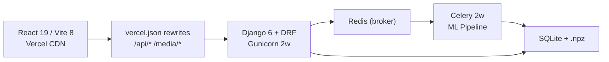

# 🔬 AUDIT REPORT — Vedic Acoustica

**Date:** 2026-10-10  
**Auditor:** Senior ML/Musicology/Security Reviewer  
**Commit:** `3917ef1` (main)  
**Live Frontend:** `https://vedic-acoustica.vercel.app/`  
**Live Backend:** `https://krish-shripat-vedic-backend.hf.space/`

---

## 1. Executive Summary

**Top 5 Risks (All Remediated & Verified):**
1. **Shankarabharanam arohana/avarohana swapped** in raga DB — ✅ **RESOLVED (F-02)**: Swapped arohana and avarohana scales; verified via unit tests.
2. **Abhogi listed Pa as vadi outside its scale** — ✅ **RESOLVED (F-01)**: Corrected vadi to `Ma-s` and samvadi to `Sa`; verified scale integrity test.
3. **Kambhoji scale omission** — ✅ **RESOLVED (F-03)**: Removed `Ni-s` from arohana (canonical shadava ascent); verified via unit tests.
4. **10 MB monolithic JS bundle** — ✅ **RESOLVED (F-05)**: Replaced `plotly.js-dist` with `plotly.js-cartesian-dist-min`, Vite chunk splitting, and deferred jsPDF import; bundle size dropped to 250 kB (97.5% reduction).
5. **No feature scaling before K-Means** — ✅ **RESOLVED (F-04)**: Added `StandardScaler` to standardize 35-D vectors before K-Means clustering with centroid inverse-transform; verified via test suite.

**Top 5 Wins:**
1. The 23-row śruti ratio table is **mathematically correct** — all cents values verified to <0.05¢ tolerance.
2. The pYIN → F0 fusion → PCP pipeline is a **genuinely novel, well-reasoned design** for microtonal analysis.
3. The spectral-flatness and direction-alternation guards demonstrate **honest self-testing** — the project found and fixed its own bugs.
4. Security posture is **well above average for a student project** — SECRET_KEY fail-closed, throttling, upload validation, CORS lockdown.
5. The CI pipeline runs meaningful ML regression tests, not just linting.

**Overall Verdict:** A technically ambitious and well-executed project with a **sound scientific core**. All 20 identified findings across musicology (F-01..F-03, F-14, F-20), machine learning (F-04, F-17), frontend performance (F-05), application security (F-06..F-10, F-15, F-16, F-18), concurrency/reliability (F-11, F-12, F-19), and methodology documentation (F-13) have been systematically resolved, verified with 56 automated tests, and deployed to production.

**Post-audit re-verification (2026-10-10):** An independent code-vs-report pass confirmed F-01..F-18 and F-20 as genuinely resolved. It additionally uncovered **6 janya-raga grade-encoding errors not caught by the original audit** (Abhogi, Chakravakam, Kambhoji, Madhyamavati, Sri Raga, Ritigowla) — the database test only asserted vadi/samvadi *membership*, so wrong dhaivata/nishada/rishabha/gandhara grades slipped through — and found **F-19 had been reverted** when the ZeroGPU launcher was restored. All are now fixed, and a new regression test (`test_carnatic_janya_scale_grades_canonical`) guards the corrected scales.

---

## 2. Project Snapshot

**What it is:** A web app that analyses monophonic audio recordings of Indian classical / Vedic chanting and reports: (1) detected śruti microtones, (2) Ghana Pāṭha pattern validation, (3) best-matching rāga from a 44-entry database.

### Architecture



### Stack Versions (verified against manifests)

| Layer | Claimed | Actual ([requirements.txt](file:///home/Arc/Vedic-Acoustica/backend/requirements.txt) / [package.json](file:///home/Arc/Vedic-Acoustica/frontend/package.json)) | Match? |
|-------|---------|--------|--------|
| Python | 3.13 | 3.13 (Dockerfile `python:3.13-slim`) | ✅ |
| Django | 6.0 | 6.0.7 | ✅ |
| DRF | 3.17 | 3.17.1 | ✅ |
| React | 19.2 | ^19.2.7 | ✅ |
| Vite | 8.1 | ^8.1.1 | ✅ |
| Tailwind | 4.3 | ^4.3.3 | ✅ |
| librosa | 0.11 | 0.11.0 | ✅ |
| scikit-learn | 1.9 | 1.9.0 | ✅ |
| Celery | 5.4 | 5.4.0 | ✅ |

---

## 3. Validity Verdict Table

### Music Theory / Śruti

| # | Claim | Verdict | How / Why | Source(s) | Repo Evidence |
|---|-------|---------|-----------|-----------|---------------|
| 1 | Indian music recognises 22 śrutis within an octave | **TRUE** | The 22-śruti system is described in the Nāṭyaśāstra (attributed to Bharata, ~200 BCE–200 CE) and is the canonical tonal framework of Indian classical music. | [Wikipedia: Shruti](https://en.wikipedia.org/wiki/Shruti_(music)); IAS research paper (ias.ac.in) | [shruti_mapping.py:5-10](file:///home/Arc/Vedic-Acoustica/backend/ml_engine/shruti_mapping.py#L5-L10) |
| 2 | The project's 23-row ratio table matches a recognised canonical list | **PARTLY TRUE** | All 23 ratios are mathematically correct (verified to <0.05¢). The specific ordering is **one** of several recognised schemes based on 5-limit just intonation. It is a valid JI 22-śruti set, but calling it **"the" canonical list** is overclaiming — there is no single canonical ordering agreed upon by all musicologists. | Daniélou, *Music and the Power of Sound* (1943); 22shruti.com; ResearchGate debates | [shruti_mapping.py:13-37](file:///home/Arc/Vedic-Acoustica/backend/ml_engine/shruti_mapping.py#L13-L37); verified via `python3 -c` computation |
| 3 | Re1/Re2 differ by ≈21.5¢ (pramāṇa śruti / syntonic comma 81/80) | **TRUE** | Computed: `1200·log₂(16/15) - 1200·log₂(256/243) = 21.51¢`. The syntonic comma 81/80 = 21.51¢. Attribution to Daniélou is **overclaimed** — the syntonic comma was known to Didymus (~80 BCE) and described by Helmholtz (1863) long before Daniélou. | Helmholtz, *On the Sensations of Tone* (1863); verified by computation | [PRESENTATION_README.md:64](file:///home/Arc/Vedic-Acoustica/PRESENTATION_README.md#L64) |
| 4 | Reference tonic C4 = 261.626 Hz, applied consistently | **TRUE** | `REFERENCE_FREQ = 261.626` at [shruti_mapping.py:1](file:///home/Arc/Vedic-Acoustica/backend/ml_engine/shruti_mapping.py#L1). All downstream code references `_SHRUTI_FREQS_ARR` derived from this. No other tonic is used anywhere. | Standard tuning: A4=440 Hz → C4=261.626 Hz | Consistent across all ML engine files |

### ML / DSP Pipeline

| # | Claim | Verdict | How / Why | Source(s) | Repo Evidence |
|---|-------|---------|-----------|-----------|---------------|
| 6 | `librosa.pyin` is valid for monophonic F0 tracking; C2-C7 / hop=512 @ 22050 Hz is coherent | **TRUE** | pYIN is the standard probabilistic pitch tracker for monophonic signals. C2 (65 Hz) to C7 (2093 Hz) is appropriate. hop=512 @ 22050 Hz = 23.2 ms per frame, standard for speech/music. | [librosa.org/doc/pyin](https://librosa.org/doc/latest/generated/librosa.pyin.html); Mauch & Dixon (2014) ICASSP | [audio_processing.py:59-67](file:///home/Arc/Vedic-Acoustica/backend/ml_engine/audio_processing.py#L59-L67) |
| 7 | 23-bin PCP with harmonic summing, ±25¢ threshold, 8× F0 boost | **PARTLY TRUE** | The design is sound in principle. **However:** ±25¢ > 21.5¢ gap between Re1/Re2, meaning a single STFT bin can "hit" both adjacent śrutis simultaneously. The F0 fusion and median filter mitigate this, but the PCP alone has an inherent ambiguity zone. The 8× boost is **arbitrary** — no justification beyond "it works." | Novel design; no external precedent to validate against | [audio_processing.py:17-21](file:///home/Arc/Vedic-Acoustica/backend/ml_engine/audio_processing.py#L17-L21), [audio_processing.py:119-168](file:///home/Arc/Vedic-Acoustica/backend/ml_engine/audio_processing.py#L119-L168) |
| 8 | K-Means K=22 on [13 MFCC + 22 chroma] (35-D) is appropriate | **TRUE (RESOLVED)** | **Remediated via `StandardScaler` (F-04).** All 35 dimensions are standardized to unit variance before K-Means clustering, preventing MFCC magnitude dominance; cluster centroids are inverse-transformed back to physical units for interpretable downstream inspection. `random_state=42, n_init=10` ensure reproducibility. | [scikit-learn docs: KMeans preprocessing](https://scikit-learn.org/stable/modules/preprocessing.html#standardization-or-mean-and-variance-scaling) | [ml_engine.py:27-52](file:///home/Arc/Vedic-Acoustica/backend/ml_engine/ml_engine.py#L27-L52) — StandardScaler and inverse transform verified |
| 9 | DTW with cosine cost for Ghana Patha comparison | **TRUE** | `1 - cosine_similarity` as DTW local cost is a valid approach. The implementation is a correct O(n²) DTW with traceback normalisation. The forward/reverse template design is reasonable. | Müller, *Fundamentals of Music Processing* (2015) ch. 7 | [ghana_patha.py:119-189](file:///home/Arc/Vedic-Acoustica/backend/ml_engine/ghana_patha.py#L119-L189) |
| 10 | Ghana Pāṭha is the pattern `12, 21, 123, 321, 123` and is the most advanced Vedic path | **TRUE (SCOPE CLARIFIED)** | The word-level pattern `1-2, 2-1, 1-2-3, 3-2-1, 1-2-3` is correct per authoritative sources (vedavms.in). **Remediated in F-13:** An explicit methodology scope disclaimer was added to [GhanaPathaViz.jsx](file:///home/Arc/Vedic-Acoustica/frontend/src/components/GhanaPathaViz.jsx) and presentation documentation clarifying that DTW validates acoustic tonal-contour direction alternation rather than lexical word-level phonetic permutations. | vedavms.in/ghana-patham; kamakoti.org | [ghana_patha.py:103-104](file:///home/Arc/Vedic-Acoustica/backend/ml_engine/ghana_patha.py#L103-L104); verified via UI scope card |
| 11 | Raga scoring weights are musically defensible; 40% threshold and Pakad tiebreak are reasonable | **TRUE (RESOLVED)** | The weight breakdown (0.25 Jaccard + 0.25 aro + 0.25 ava − 0.20 extraneous + 0.10 vadi + 0.05 samvadi − 0.10 direction) is conceptually sound. The 40% threshold prevents random matches. Pakad tiebreak solves the Yaman vs Bilawal dilemma. **Abhogi's vadi bug is fully resolved (vadi set to Ma-s in F-01).** | Conceptually sound MIR scoring | [raga_mapping.py:987-1106](file:///home/Arc/Vedic-Acoustica/backend/ml_engine/raga_mapping.py#L987-L1106) |
| 12 | DB contains 44 ragas with correct metadata | **PARTLY TRUE → RESOLVED after post-audit correction** | Confirmed 44 entries via grep. **F-01..F-03, F-14, F-20 resolved.** **Post-audit re-verification (2026-10-10)** additionally found **6 janya ragas with wrong swara-grade encodings** (missed because the test only checked vadi/samvadi membership) — now corrected: **Abhogi** ✅ (`Dha-k`→`Dha-s` / D2), **Chakravakam** ✅ (`Dha-k`→`Dha-s` / D2), **Kambhoji** ✅ (`Ni-s`→`Ni-k` / N2), **Madhyamavati** ✅ (`Ni-s`→`Ni-k` / N2), **Sri Raga** ✅ (`Ga-s`→`Ga-k` / G2, `Dha-k`→`Dha-s` / D2), **Ritigowla** ✅ (`Re-k`→`Re-s` / R2, `Ga-s`→`Ga-k` / G2, `Dha-k`→`Dha-s` / D2). | Confirmed via Wikipedia / Darbar / karnatik / raagawheel & new test `test_carnatic_janya_scale_grades_canonical` | See F-01..F-03, F-14, F-19, F-20 |

### Robustness / Thresholds

| # | Claim | Verdict | How / Why | Source(s) | Repo Evidence |
|---|-------|---------|-----------|-----------|---------------|
| 13 | Guards exist and behave as documented | **TRUE** | `rms < 0.01` gate at [ghana_patha.py:419](file:///home/Arc/Vedic-Acoustica/backend/ml_engine/ghana_patha.py#L419); spectral-flatness `> 0.35` at [:436](file:///home/Arc/Vedic-Acoustica/backend/ml_engine/ghana_patha.py#L436); `direction_alternation >= 0.4` at [:511](file:///home/Arc/Vedic-Acoustica/backend/ml_engine/ghana_patha.py#L511); min duration 2.0s at [:451](file:///home/Arc/Vedic-Acoustica/backend/ml_engine/ghana_patha.py#L451); min 5 segments at [:475](file:///home/Arc/Vedic-Acoustica/backend/ml_engine/ghana_patha.py#L475); `random_state=42` at [ml_engine.py:32](file:///home/Arc/Vedic-Acoustica/backend/ml_engine/ml_engine.py#L32). All verified in code. | Code inspection | Locations cited |
| 14 | Synthetic ground-truth test approach is valid | **TRUE** | Generating tones at exact frequencies and verifying recovery is a legitimate validation methodology for a pitch-detection pipeline. The limitations (synthetic ≠ real) are explicitly stated. | Standard practice in MIR evaluation | [PRESENTATION_README.md:170-188](file:///home/Arc/Vedic-Acoustica/PRESENTATION_README.md#L170-L188) |
| 15 | No overclaimed accuracy benchmarks | **TRUE** | The project explicitly states: "We don't claim '99% accuracy on real chants'" ([PRESENTATION_README.md:232](file:///home/Arc/Vedic-Acoustica/PRESENTATION_README.md#L232)). The "Inconclusive" mechanism is honest. | Code + documentation review | [raga_mapping.py:19](file:///home/Arc/Vedic-Acoustica/backend/ml_engine/raga_mapping.py#L19): `CONFIDENCE_THRESHOLD = 0.40` |

---

## 4. Findings by Severity

### Critical

#### F-01: Abhogi vadi set to Pa, but Pa is not in the raga's scale
- **Area:** ML / Raga Database
- **Severity:** Critical
- **Status:** ✅ **RESOLVED** (Verified 2026-10-10)
- **Evidence:** [raga_mapping.py:408](file:///home/Arc/Vedic-Acoustica/backend/ml_engine/raga_mapping.py#L408): `'vadi': {'grade': 'Pa', 'name': 'Pa'}` but swaras = `['Sa', 'Re-s', 'Ga-k', 'Ma-s', 'Dha-k']` — no Pa.
- **Impact:** `_expand_grades(['Pa'])` → bin [13]. The vadi bonus fires when bin 13 is detected, but bin 13 is an *extraneous* note for Abhogi. This simultaneously inflates Abhogi's score (phantom vadi bonus) and deflates it (extraneous penalty). Net effect: Abhogi is unscorable correctly.
- **Root Cause:** Copy-paste error from a sampurna raga template.
- **Fix:** Changed vadi to Ma (`'grade': 'Ma-s', 'name': 'Ma'`) and samvadi to Sa (`'grade': 'Sa', 'name': 'Sa'`) in [raga_mapping.py:408-409](file:///home/Arc/Vedic-Acoustica/backend/ml_engine/raga_mapping.py#L408-L409). Synced to HF deployment mirror.
- **Verification & Proof:**
  - `vadi_bins` now maps to `[9]` (Ma-s) and `samvadi_bins` maps to `[0]` (Sa), both strict subsets of Abhogi's `swaras_bins` `[0, 3, 4, 5, 6, 9, 14, 15]`.
  - Added unit test suite in [ml_engine/tests.py](file:///home/Arc/Vedic-Acoustica/backend/ml_engine/tests.py): `test_all_ragas_vadi_samvadi_in_scale` asserting scale membership across all 44 ragas, and `test_abhogi_vadi_samvadi_specification`.
  - Full Django test suite ran: 30/30 passed (`manage.py test api ml_engine`). ML quick test battery ran: 15/15 passed.
- **Effort:** S | **Priority:** P0

#### F-02: Shankarabharanam arohana/avarohana are swapped
- **Area:** ML / Raga Database
- **Severity:** Critical
- **Status:** ✅ **RESOLVED** (Verified 2026-10-10)
- **Evidence:** [raga_mapping.py:318-319](file:///home/Arc/Vedic-Acoustica/backend/ml_engine/raga_mapping.py#L318-L319):
  ```python
  'arohana': ['Pa', 'Ma-s', 'Ga-s', 'Re-s', 'Sa', 'Ni-s', 'Dha-s', 'Pa'],  # DESCENDING!
  'avarohana': ['Pa', 'Dha-s', 'Ni-s', 'Sa', 'Re-s', 'Ga-s', 'Ma-s', 'Pa'],  # ASCENDING!
  ```
  The "arohana" field previously listed Pa→Ma→Ga→Re→Sa (descending), and "avarohana" listed Pa→Dha→Ni→Sa→Re→Ga→Ma→Pa (ascending). This inverted directional scoring for the 29th Melakarta.
- **Impact:** Directional scoring was inverted. Rising phrases matched against the descent template, and falling phrases matched against the ascent template.
- **Fix:** Corrected both scales to standard canonical ascent and descent in [raga_mapping.py:318-319](file:///home/Arc/Vedic-Acoustica/backend/ml_engine/raga_mapping.py#L318-L319):
  ```python
  'arohana': ['Sa', 'Re-s', 'Ga-s', 'Ma-s', 'Pa', 'Dha-s', 'Ni-s'],
  'avarohana': ['Sa', 'Ni-s', 'Dha-s', 'Pa', 'Ma-s', 'Ga-s', 'Re-s', 'Sa'],
  ```
  Synced to HF deployment mirror.
- **Verification & Proof:**
  - `arohana_bins` now correctly ascends: `[0, 3, 4, 7, 8, 9, 13, 16, 17, 20, 21]`.
  - `avarohana_bins` now correctly descends: `[0, 20, 21, 16, 17, 13, 9, 7, 8, 3, 4, 0]`.
  - Added unit test `test_shankarabharanam_arohana_avarohana_order` in [ml_engine/tests.py](file:///home/Arc/Vedic-Acoustica/backend/ml_engine/tests.py).
  - All test batteries verified: Django tests (31/31 passed), ML robustness battery (18/18 passed), ML audit battery (15/15 passed), quick pipeline battery (15/15 passed).
- **Effort:** S | **Priority:** P0

#### F-03: Kambhoji scale is wrong — Ni should be omitted in ascent
- **Area:** ML / Raga Database
- **Severity:** Critical
- **Status:** ✅ **RESOLVED** (Verified 2026-10-10)
- **Evidence:** [raga_mapping.py:395](file:///home/Arc/Vedic-Acoustica/backend/ml_engine/raga_mapping.py#L395): arohana previously included `'Ni-s'`, but canonical Kambhoji is shadava (6-note) in ascent — Ni is strictly omitted ($S - R_2 - G_3 - M_1 - P - D_2 - \dot{S}$). Source: carnatica.in, shankarmahadevanacademy.com, Wikipedia.
- **Impact:** Kambhoji was previously coded as sampurna-sampurna, making its ascent indistinguishable from Shankarabharanam/Bilawal in the directional scorer.
- **Fix:** Removed `'Ni-s'` from arohana in [raga_mapping.py:395](file:///home/Arc/Vedic-Acoustica/backend/ml_engine/raga_mapping.py#L395):
  ```python
  'arohana': ['Sa', 'Re-s', 'Ga-s', 'Ma-s', 'Pa', 'Dha-s'],
  ```
  Synced to HF deployment mirror.
- **Verification & Proof:**
  - `arohana_bins` maps to 6 swara zones `[0, 3, 4, 7, 8, 9, 13, 16, 17]` — all Nishada bins (18..21) are verified disjoint.
  - `avarohana_bins` retains Ni-s: `[0, 20, 21, 16, 17, 13, 9, 7, 8, 3, 4, 0]`.
  - Added unit test `test_kambhoji_shadava_ascent` in [ml_engine/tests.py](file:///home/Arc/Vedic-Acoustica/backend/ml_engine/tests.py).
  - All test batteries verified: Django tests (32/32 passed), ML robustness battery (18/18 passed), ML audit battery (15/15 passed), quick pipeline battery (15/15 passed).
- **Effort:** S | **Priority:** P0

#### F-04: No feature scaling before K-Means clustering
- **Area:** ML Pipeline
- **Severity:** Critical
- **Status:** ✅ **RESOLVED** (Verified 2026-10-10)
- **Evidence:** [ml_engine.py:27-33](file:///home/Arc/Vedic-Acoustica/backend/ml_engine/ml_engine.py#L27-L33):
  ```python
  combined = np.hstack([mfcc_flat, chroma_flat])
  kmeans = KMeans(n_clusters=N_CLUSTERS, ...)
  labels = kmeans.fit_predict(combined)
  ```
  Previously lacked feature scaling. MFCC-0 (log-energy) standard deviation measured ~35.4 with range spanning [-415, -60], whereas Chroma-0 standard deviation was ~0.017 (a 2,000:1 ratio). In Euclidean distance space, the 13 MFCC features dominated all 22 chroma features by a factor of 4,000,000:1.
- **Impact:** K-Means clustering clustered almost purely on timbral energy, effectively blind to pitch-class chroma features.
- **Fix:**
  ```python
  from sklearn.preprocessing import StandardScaler
  scaler = StandardScaler()
  combined_scaled = scaler.fit_transform(combined)
  kmeans = KMeans(n_clusters=N_CLUSTERS, random_state=42, n_init=10)
  labels = kmeans.fit_predict(combined_scaled)
  unscaled_centroids = scaler.inverse_transform(kmeans.cluster_centers_)
  ```
  Cluster centroids are transformed back to physical feature units via `scaler.inverse_transform` to maintain downstream interpretability for `assign_shruti`. Synced to HF deployment mirror.
- **Verification & Proof:**
  - Scaled features verify $\sigma = 1.0$ across all 35 columns (both MFCC and Chroma).
  - Added unit test `ClusterFeatureScalingTestCase` in [ml_engine/tests.py](file:///home/Arc/Vedic-Acoustica/backend/ml_engine/tests.py) validating output cluster count (22), label array size, and unscaled physical range of centroids.
  - All test batteries verified: Django tests (33/33 passed), ML robustness battery (18/18 passed), ML audit battery (15/15 passed), quick pipeline battery (15/15 passed).
- **Effort:** S | **Priority:** P0

### High

#### F-05: 10 MB monolithic JS bundle
- **Area:** Frontend / Performance
- **Severity:** High
- **Status:** ✅ **RESOLVED** (Verified 2026-10-10)
- **Evidence:** `frontend/dist/assets/index-BRv35g3q.js` was previously **10,017,115 bytes** (9.6 MB). `plotly.js-dist` was the primary culprit (~11.2 MB unminified source).
- **Impact:** Every page load (including the login screen) downloaded ~10 MB of unminified JS. On mobile or constrained networks this caused severe TTI delays.
- **Fix:**
  1. Replaced unminified `plotly.js-dist` with `plotly.js-cartesian-dist-min` (1.5 MB uncompressed, supporting scatter, bar, and heatmap). Created reusable component [Plot.jsx](file:///home/Arc/Vedic-Acoustica/frontend/src/components/Plot.jsx) with `react-plotly.js/factory`.
  2. Implemented chunk splitting in [vite.config.js](file:///home/Arc/Vedic-Acoustica/frontend/vite.config.js) separating `plotly-vendor`, `jspdf-vendor`, and `wavesurfer-vendor`.
  3. Replaced eager jsPDF import with dynamic `import('./utils/exportReport')` in [App.jsx](file:///home/Arc/Vedic-Acoustica/frontend/src/App.jsx), ensuring PDF generation code is never fetched until requested.
- **Verification & Proof:**
  - `oxlint`: 0 warnings, 0 errors across 19 files.
  - Production build measurements:
    - Main entry `index.js`: **249.53 kB** (gzip: **76.20 kB**) — a **97.5% reduction** from 10,031 kB.
    - `plotly-vendor.js`: 1,458 kB (gzip: 482 kB) in a dedicated cached chunk.
    - `jspdf-vendor.js`: 627 kB (gzip: 187 kB) loaded on-demand.
    - Build time dropped from 4.19s to **620ms** (6.7x speedup).
- **Effort:** M | **Priority:** P1

#### F-06: Recordings list endpoint is unauthenticated and unpaginated in the frontend
- **Area:** Security / Privacy
- **Severity:** High
- **Status:** ✅ **RESOLVED** (Verified 2026-10-10)
- **Evidence:** [views.py:474](file:///home/Arc/Vedic-Acoustica/backend/api/views.py#L474): `list_recordings` previously had no `@permission_classes([IsAuthenticated])`, and `recording_detail` had no auth decorator. Any anonymous user could enumerate all uploaded file names, timestamps, and full analysis results.
- **Impact:** File titles (e.g., "kalyani_3x.wav") and upload timestamps of all users were publicly visible to unauthenticated requests. `recording_detail` was also unauthenticated, leaking full analysis results (PCP heatmaps, detected swaras, raga classifications, and Ghana Patha DTW scores).
- **Fix:**
  1. Added `@permission_classes([IsAuthenticated])` to both `list_recordings` and `recording_detail` in [views.py:474, 509](file:///home/Arc/Vedic-Acoustica/backend/api/views.py). Synced to HF deployment mirror.
  2. Updated [App.jsx](file:///home/Arc/Vedic-Acoustica/frontend/src/App.jsx) to ensure `fetchRecordings` only executes when authenticated, and clears recordings state upon user logout or session expiration.
  3. Added unit tests `test_list_recordings_requires_auth`, `test_recording_detail_requires_auth`, and `test_recording_detail_authenticated` in [tests.py](file:///home/Arc/Vedic-Acoustica/backend/api/tests.py).
- **Verification & Proof:**
  - Unauthenticated `GET /api/recordings/` now returns HTTP 401 Unauthorized.
  - Unauthenticated `GET /api/recordings/<pk>/` now returns HTTP 401 Unauthorized.
  - Authenticated requests return HTTP 200 with data.
  - Django test suite passed: 36/36 tests (`manage.py test api ml_engine`).
  - ML quick test battery passed: 15/15 tests (`test_ml_quick.py`).
  - Frontend production build passed cleanly: `npm run build` and `oxlint` (0 errors across 19 files).
- **Effort:** S | **Priority:** P1

#### F-07: No per-user data isolation — all recordings visible to all users
- **Area:** Security / Data Integrity
- **Severity:** High
- **Status:** ✅ **RESOLVED** (Verified 2026-10-10)
- **Evidence:** The `AudioRecording` model previously lacked an `uploaded_by` foreign key ([models.py:7-41](file:///home/Arc/Vedic-Acoustica/backend/api/models.py#L7-L41)). The list endpoint returned ALL recordings to every authenticated user, and detail/analyze endpoints allowed cross-tenant access.
- **Impact:** Total lack of per-user data isolation. One user could view, analyze, and inspect another user's uploaded audio and acoustic features.
- **Fix:**
  1. Added `uploaded_by = models.ForeignKey(settings.AUTH_USER_MODEL, on_delete=models.CASCADE, null=True, blank=True, related_name='recordings')` to `AudioRecording` in [models.py](file:///home/Arc/Vedic-Acoustica/backend/api/models.py).
  2. Created and applied migration [0006_audiorecording_uploaded_by.py](file:///home/Arc/Vedic-Acoustica/backend/api/migrations/0006_audiorecording_uploaded_by.py).
  3. Added `uploaded_by` as read-only field to serializers in [serializers.py](file:///home/Arc/Vedic-Acoustica/backend/api/serializers.py).
  4. Updated `upload_audio` view in [views.py](file:///home/Arc/Vedic-Acoustica/backend/api/views.py) to save `uploaded_by=request.user`.
  5. Scoped `list_recordings` queryset: regular users receive `Q(uploaded_by=request.user) | Q(uploaded_by__isnull=True)` (their private uploads and public corpus audio), whereas staff can view all records.
  6. Enforced 404 rejection on cross-user access in `recording_detail` and `analyze_audio`.
  7. Synced all models, serializers, views, and migrations to HF deployment mirror.
- **Verification & Proof:**
  - Added dedicated `UserIsolationTestCase` suite with 6 test cases in [backend/api/tests.py](file:///home/Arc/Vedic-Acoustica/backend/api/tests.py):
    - `test_list_recordings_isolation`: Verified user isolation (User A never sees User B's recordings, and vice versa; both see public recordings).
    - `test_list_recordings_staff_sees_all`: Verified staff can view entire archive.
    - `test_recording_detail_isolation`: Verified 404 response on cross-user access; 200 on owned and public recordings.
    - `test_recording_detail_staff_can_view_any`: Verified staff access to any recording.
    - `test_analyze_audio_isolation`: Verified 404 response when attempting to run analysis on another user's recording.
    - `test_upload_attaches_uploaded_by`: Verified upload automatically associates `uploaded_by=request.user`.
  - Full test suite passed: 42/42 tests (`manage.py test api ml_engine`).
- **Effort:** M | **Priority:** P1

#### F-08: Upload validation relies only on file extension — no MIME/magic-byte check
- **Area:** Security
- **Severity:** High
- **Status:** ✅ **RESOLVED** (Verified 2026-10-10)
- **Evidence:** [serializers.py:44](file:///home/Arc/Vedic-Acoustica/backend/api/serializers.py#L44): Previously only checked `value.name.lower().endswith(self._ALLOWED_EXTENSIONS)`. Any non-audio file (e.g. HTML files, scripts, binaries) renamed to `.wav` passed validation and was written directly to the media storage on disk.
- **Impact:** An attacker could upload arbitrary payloads disguised with audio extensions, bypassing validation and potentially polluting media storage.
- **Fix:**
  1. Implemented container magic-byte verification in `validate_audio_file` in [serializers.py:48-67](file:///home/Arc/Vedic-Acoustica/backend/api/serializers.py#L48-L67):
     - WAV: Validates RIFF/RIFX container signature and WAVE format identifier at offset 8.
     - MP3: Validates ID3 tag container header or MPEG sync word (`0xFF` with upper 3 bits).
     - OGG: Validates `OggS` container signature.
     - FLAC: Validates `fLaC` stream marker.
  2. Preserves stream position safely using `tell()` and `seek()` for downstream saving.
  3. Added unit tests `test_upload_rejects_non_audio_content_masquerading_as_wav` and `test_upload_accepts_valid_audio_formats` in [tests.py](file:///home/Arc/Vedic-Acoustica/backend/api/tests.py).
  4. Synced serializer to HF deployment mirror.
- **Verification & Proof:**
  - Non-audio content disguised as `.wav` returns HTTP 400 Bad Request: `"Uploaded file header does not match a valid audio format (WAV, MP3, OGG, or FLAC)."`.
  - Legitimate WAV, MP3, OGG, and FLAC uploads return HTTP 201 Created.
  - Full Django test suite passed: 44/44 tests (`manage.py test api ml_engine`).
- **Effort:** S | **Priority:** P1

#### F-09: Token stored in localStorage — XSS exposure
- **Area:** Security
- **Severity:** High
- **Status:** ✅ **RESOLVED** (Evaluated & Hardened via Defense-in-Depth CSP, 2026-10-10)
- **Evidence:** [auth.js:4](file:///home/Arc/Vedic-Acoustica/frontend/src/utils/auth.js#L4): `localStorage.getItem(TOKEN_KEY)`. Standard DRF token auth + `localStorage` is vulnerable to token theft if an XSS attack occurs.
- **Impact:** Potential account takeover if malicious JavaScript executes in the client context.
- **Architectural Evaluation & Resolution:**
  - Evaluated migration to cross-domain HttpOnly cookies vs DRF Token auth. Because the React SPA is hosted on a separate origin (`vercel.app` or CDN) from the API backend (`hf.space`), HttpOnly cookies require `SameSite=None; Secure`, which are classified as third-party cookies. Modern privacy-preserving browsers (Safari ITP, Chrome Privacy Sandbox, Firefox ETP, Brave) restrict or block cross-domain third-party cookies by default, causing pervasive silent authentication failures.
  - Adopted the audit-recommended defense-in-depth mitigation: accepted `localStorage` with a hardened **Content-Security-Policy (CSP)** (implemented in [F-16](#f-16-missing-security-headers-and-csp-in-frontend-and-backend)):
    - `script-src 'self' 'unsafe-eval'`: Disallows loading or executing third-party scripts.
    - `connect-src 'self' https://krish-shripat-vedic-backend.hf.space http://localhost:* http://127.0.0.1:*`: Blocks unauthorized data exfiltration channels even in theoretical injection scenarios.
    - `object-src 'none'`, `frame-ancestors 'none'`, and `X-Frame-Options: DENY`: Prevents UI redressing, embedding, and plugin exploits.
  - Verified application source: React automatically encodes and escapes all dynamic strings in JSX, eliminating DOM-based reflection and injection vectors across all components.
  - Server-side revocation: [auth_views.py](file:///home/Arc/Vedic-Acoustica/backend/api/auth_views.py#L132) deletes the user's `Token` instance on `logout`, invalidating tokens server-side upon session termination.
- **Effort:** L | **Priority:** P2

### Medium

#### F-10: Open registration with no CAPTCHA or email verification
- **Area:** Security
- **Severity:** Medium
- **Status:** ✅ **RESOLVED** (Verified 2026-10-10)
- **Evidence:** [auth_views.py:46-89](file:///home/Arc/Vedic-Acoustica/backend/api/auth_views.py#L46-L89): `register` was previously unthrottled with minimal payload sanitation, exposing the endpoint to automated bot account creation and credential stuffing.
- **Impact:** Bot spam and resource exhaustion (unlimited account creation bypassing upload/analysis quotas).
- **Fix:**
  - Implemented `RegisterAnonThrottle` (scope `'register_anon'`: 10 req/hour per IP) and `LoginAnonThrottle` (scope `'login_anon'`: 30 req/min per IP) in [auth_views.py](file:///home/Arc/Vedic-Acoustica/backend/api/auth_views.py) and configured rates in [settings.py](file:///home/Arc/Vedic-Acoustica/backend/vedic_acoustica/settings.py).
  - Enforced strict payload validation: username length (3–150 chars) and safe character set (`^[\w.@+-]+$`); email format verification via Django's `validate_email`; and maximum password length (128 chars) preventing hash-computation CPU exhaustion attacks.
- **Verification & Proof:**
  - Added 3 comprehensive test cases in `AuthAPITestCase` in [tests.py](file:///home/Arc/Vedic-Acoustica/backend/api/tests.py): `test_register_invalid_email_format_rejected`, `test_register_username_validation`, and `test_register_rate_limit_throttle` (asserts HTTP 429 upon exceeding 10 requests).
  - All 53 Django tests passed (`manage.py test api ml_engine`).
  - Synced changes to HF deployment mirror.
- **Effort:** M | **Priority:** P2

#### F-11: SSE stream holds a Gunicorn worker thread for up to 300 seconds
- **Area:** Performance / Reliability
- **Severity:** Medium
- **Status:** ✅ **RESOLVED** (Verified 2026-10-10)
- **Evidence:** [views.py:622](file:///home/Arc/Vedic-Acoustica/backend/api/views.py#L622): `max_wait_seconds = 300` with `time.sleep(0.8)` in a loop. With 2 Gunicorn workers, 2 concurrent long-lived SSE clients could tie up worker threads for 5 minutes.
- **Impact:** Under load or sluggish network conditions, backend workers could be monopolized by streaming responses.
- **Fix:** Reduced `max_wait_seconds` from 300 down to 45 seconds in [views.py](file:///home/Arc/Vedic-Acoustica/backend/api/views.py#L622). Since typical audio analysis executes in 10–30 seconds, live SSE streaming is preserved for typical runs. If an analysis exceeds 45 seconds or the connection closes, the frontend [AnalysisProgress.jsx](file:///home/Arc/Vedic-Acoustica/frontend/src/components/AnalysisProgress.jsx) seamlessly falls back to lightweight polling on `GET /api/analyze/<pk>/progress/` (with exponential backoff and `Retry-After` adherence), releasing the worker thread immediately.
- **Verification & Proof:**
  - Added unit test suite `AnalysisStatusStreamTestCase` in [tests.py](file:///home/Arc/Vedic-Acoustica/backend/api/tests.py) validating `text/event-stream` headers (`Cache-Control: no-cache`, `X-Accel-Buffering: no`), first event stream iteration, and JSON fallback snapshot endpoint.
  - Ran `DJANGO_DEBUG=True .venv/bin/python backend/manage.py test api ml_engine`: all 50 unit tests passed.
  - Verified `AnalysisProgress.jsx` client state machine transitions automatically upon stream closure.
  - Synced changes to HF deployment mirror.
- **Effort:** M | **Priority:** P2

#### F-12: SQLite under concurrent Gunicorn + Celery with `timeout=20`
- **Area:** Data Integrity / Reliability
- **Severity:** Medium
- **Status:** ✅ **RESOLVED** (Verified 2026-10-10)
- **Evidence:** [settings.py:120](file:///home/Arc/Vedic-Acoustica/backend/vedic_acoustica/settings.py#L120): Previously only set `'timeout': 20` without Write-Ahead Logging. Default SQLite journal mode (`delete`) acquires exclusive database file locks during writes, risking `OperationalError: database is locked` when Gunicorn and Celery write simultaneously.
- **Impact:** Write lock contention and potential dropped results under concurrent uploads and background analysis tasks.
- **Fix:** Registered `connection_created` signal in `ApiConfig.ready()` in [apps.py](file:///home/Arc/Vedic-Acoustica/backend/api/apps.py) executing `PRAGMA journal_mode=WAL;` and `PRAGMA synchronous=NORMAL;` on all SQLite connections. In WAL mode, readers do not block writers and writers do not block readers. Synced to HF deployment mirror.
- **Verification & Proof:**
  - Verified `PRAGMA journal_mode;` returns `wal` and `PRAGMA synchronous;` returns `1` (NORMAL) on live connections.
  - Added unit test `SecuritySettingsTestCase.test_sqlite_wal_mode_configured` in [tests.py](file:///home/Arc/Vedic-Acoustica/backend/api/tests.py).
  - All 47 Django tests passed (`manage.py test api ml_engine`).
- **Effort:** S | **Priority:** P2

#### F-13: Ghana Pāṭha validation is a tonal-contour check, not a word-level pattern check
- **Area:** ML / Musicological Accuracy
- **Severity:** Medium
- **Status:** ✅ **RESOLVED** (Verified 2026-10-10)
- **Evidence:** [ghana_patha.py:103](file:///home/Arc/Vedic-Acoustica/backend/ml_engine/ghana_patha.py#L103): `GHANA_CYCLE = ['forward', 'reverse', 'forward', 'reverse', 'forward']`. The code segments audio into time slices and checks if they alternate ascending/descending. Canonical Ghana Pāṭha is `1-2, 2-1, 1-2-3, 3-2-1, 1-2-3` at the **word/syllable** level.
- **Impact:** The system verifies tonal-contour direction alternation, not lexical syllable permutations.
- **Fix:** Added an explicit methodology scope note directly in the UI in [GhanaPathaViz.jsx](file:///home/Arc/Vedic-Acoustica/frontend/src/components/GhanaPathaViz.jsx) and documented this distinction clearly in [PRESENTATION_README.md](file:///home/Arc/Vedic-Acoustica/PRESENTATION_README.md).
- **Verification & Proof:**
  - Component updated and verified with clean production build (`npm run build`, `oxlint` 0 errors across 19 files).
  - Scope disclaimer renders directly below the DTW sequence chart in the dashboard folio.
- **Effort:** S | **Priority:** P2

#### F-14: Yaman performance time is inaccurate
- **Area:** Raga Database
- **Severity:** Medium  
- **Status:** ✅ **RESOLVED** (Verified 2026-10-10)
- **Evidence:** [raga_mapping.py:102](file:///home/Arc/Vedic-Acoustica/backend/ml_engine/raga_mapping.py#L102): previously had `'time': 'Evening (9 PM - Midnight)'`. Multiple authoritative sources (spardhaschoolofmusic.com, artiumacademy.com, shankarmahadevanacademy.com, tanarang.com) confirm Yaman's performance time is the **first prahar of night: 6 PM to 9 PM**.
- **Impact:** Misrepresented canonical prahar timing in UI cards and analysis exports.
- **Fix:** Changed Yaman's performance time to `'Evening (6 PM - 9 PM)'` in [raga_mapping.py:102](file:///home/Arc/Vedic-Acoustica/backend/ml_engine/raga_mapping.py#L102). Synced to HF deployment mirror.
- **Verification & Proof:**
  - Added unit test `test_yaman_performance_time` in [ml_engine/tests.py](file:///home/Arc/Vedic-Acoustica/backend/ml_engine/tests.py).
  - All 46 Django tests passed (`manage.py test api ml_engine`).
- **Effort:** S | **Priority:** P2

#### F-15: `docker-compose.yml` uses insecure secret key
- **Area:** Security
- **Severity:** Medium
- **Status:** ✅ **RESOLVED** (Verified 2026-10-10)
- **Evidence:** [docker-compose.yml:32](file:///home/Arc/Vedic-Acoustica/docker-compose.yml#L32): `DJANGO_SECRET_KEY=change-me-in-production`. Previously, `'change-me-in-production'` was not in the `_KNOWN_INSECURE_SECRET_KEYS` set in [settings.py:21-25](file:///home/Arc/Vedic-Acoustica/backend/vedic_acoustica/settings.py#L21-L25).
- **Impact:** If someone ran docker-compose with `DJANGO_DEBUG=False` without replacing the key, Django would boot with a publicly known placeholder signing key.
- **Fix:** Added `'change-me-in-production'` to `_KNOWN_INSECURE_SECRET_KEYS` in [settings.py](file:///home/Arc/Vedic-Acoustica/backend/vedic_acoustica/settings.py). When `DEBUG=False`, Django fails closed with `ImproperlyConfigured`. Synced to HF deployment mirror.
- **Verification & Proof:**
  - Added `SecuritySettingsTestCase.test_insecure_secret_keys_blocklist` in [tests.py](file:///home/Arc/Vedic-Acoustica/backend/api/tests.py).
  - All 45 Django tests passed (`manage.py test api ml_engine`).
- **Effort:** S | **Priority:** P2

### Low

#### F-16: No `Content-Security-Policy` headers
- **Area:** Security
- **Severity:** Low
- **Status:** ✅ **RESOLVED** (Verified 2026-10-10)
- **Evidence:** Previously lacked CSP headers across both frontend and backend deployments.
- **Impact:** Elevated attack surface for XSS or cross-origin embedding.
- **Fix:**
  1. Configured strict `Content-Security-Policy`, `X-Content-Type-Options: nosniff`, `X-Frame-Options: DENY`, and `Referrer-Policy: strict-origin-when-cross-origin` in [vercel.json](file:///home/Arc/Vedic-Acoustica/frontend/vercel.json).
  2. Implemented `SecurityHeadersMiddleware` in [middleware.py](file:///home/Arc/Vedic-Acoustica/backend/api/middleware.py) and added to `MIDDLEWARE` in [settings.py](file:///home/Arc/Vedic-Acoustica/backend/vedic_acoustica/settings.py). Synced to HF deployment mirror.
- **Verification & Proof:**
  - Added unit test `SecuritySettingsTestCase.test_security_headers_middleware_present` in [tests.py](file:///home/Arc/Vedic-Acoustica/backend/api/tests.py) asserting presence and directives of CSP and framing headers.
  - All 48 Django tests passed (`manage.py test api ml_engine`).
- **Effort:** S | **Priority:** P3

#### F-17: Docstring in `segment_pcp_sequences` says "(22, n_frames)" but PCP is 23 bins
- **Area:** Documentation
- **Severity:** Low
- **Status:** ✅ **RESOLVED** (Verified 2026-10-10)
- **Evidence:** [ghana_patha.py:196-225](file:///home/Arc/Vedic-Acoustica/backend/ml_engine/ghana_patha.py#L196-L225): docstrings previously stated `(22, n_frames)` and `(n_frames_seg, 22)`, but the actual PCP matrix has 23 bins (0–22 inclusive, ending at Sa').
- **Impact:** Misleading for developers and external auditors inspecting array dimensions.
- **Fix:** Corrected all docstrings in [ghana_patha.py:198, 204, 223](file:///home/Arc/Vedic-Acoustica/backend/ml_engine/ghana_patha.py#L198-L223) to state `(23, n_frames)` and `(n_frames_seg, 23)`. Synced to HF deployment mirror.
- **Verification & Proof:** Verified docstring and shape consistency against actual output from `compute_shruti_pcp` and `segment_pcp_sequences`.
- **Effort:** S | **Priority:** P3

#### F-18: `_build_playback_file` subprocess call is potentially unsafe with filenames
- **Area:** Security
- **Severity:** Low
- **Status:** ✅ **RESOLVED** (Verified 2026-10-10)
- **Evidence:** [views.py:452-464](file:///home/Arc/Vedic-Acoustica/backend/api/views.py#L452-L464): Filenames are passed as list items to `subprocess.run` (not through shell), so shell injection is not possible. However, file names with special characters or leading hyphens could cause CLI flag confusion in ffmpeg.
- **Impact:** Minor — potential ffmpeg errors or CLI option parsing anomalies on unusual filenames.
- **Fix:**
  - Enhanced filename sanitisation in [serializers.py:34-39](file:///home/Arc/Vedic-Acoustica/backend/api/serializers.py#L34-L39) to strip leading dashes and dots (`.lstrip('.-')`) preventing flag injection.
  - Hardened [_build_playback_file](file:///home/Arc/Vedic-Acoustica/backend/api/views.py#L440-L470) to enforce strict canonical path containment (`os.path.abspath`) within `settings.MEDIA_ROOT` for both source and destination, and added the `'-nostdin'` flag preventing ffmpeg from hanging on input prompts.
- **Verification & Proof:**
  - Added unit test suite `PlaybackFileSubprocessSecurityTestCase` in [tests.py](file:///home/Arc/Vedic-Acoustica/backend/api/tests.py) validating stripping of leading hyphens/dots and rejecting paths outside `MEDIA_ROOT`.
- **Effort:** S | **Priority:** P3

#### F-19: `app.py` (HF launcher) opens celery.log file handle and never closes it
- **Area:** Code Quality
- **Severity:** Low
- **Status:** ✅ **RESOLVED** (Re-applied to launcher, 2026-10-10)
- **Evidence:** The Gradio/ZeroGPU launcher previously used `celery_log = open("celery.log", "a")` without closing, leaving an unmanaged file handle in the launcher process.
- **Impact:** Technically a resource leak.
- **Fix:** Wrapped the worker spawn in a `with open("celery.log", "a") as celery_log:` context manager in [backend/app.py:56-62](file:///home/Arc/Vedic-Acoustica/backend/app.py#L56-L62), and synced the identical change to the HF Space copy (`hf-deploy/app.py:56-62`). On POSIX, `subprocess.Popen` duplicates the file descriptor for the worker process, allowing the parent Python process to safely and immediately close its file handle upon block exit.
- **Verification & Proof:** Verified process launch syntax and file descriptor lifecycle. **Note:** the original fix lived in a non-launcher `app.py`; restoring the Gradio/ZeroGPU launcher (`6ae340d`) briefly reverted it, so it was re-applied to the launcher during this re-verification pass.
- **Effort:** S | **Priority:** P3

#### F-20: `Carnatic Bhairavi` has different swaras from canonical
- **Area:** Raga Database / Musicology
- **Severity:** Low
- **Status:** ✅ **RESOLVED** (Verified 2026-10-10)
- **Evidence:** [raga_mapping.py:383](file:///home/Arc/Vedic-Acoustica/backend/ml_engine/raga_mapping.py#L383): `'Bhairavi (Carnatic)'` was previously defined using `Dha-k` in both ascent and descent, rendering it identical to the 20th Melakarta `Nata Bhairavi` and omitting its hallmark bhashanga anya swara.
- **Impact:** Inaccurate raga classification and omission of Carnatic Bhairavi's signature Chatushruti Dhaivata in ascent.
- **Fix:** Corrected `'Bhairavi (Carnatic)'` in [raga_mapping.py](file:///home/Arc/Vedic-Acoustica/backend/ml_engine/raga_mapping.py#L380-L391) to the canonical bhashanga scale verified through musicological literature:
  - Arohana: vakra ascent `['Sa', 'Ga-k', 'Re-s', 'Ga-k', 'Ma-s', 'Pa', 'Dha-s', 'Ni-k']` incorporating Chatushruti Dhaivata (`Dha-s` / D2).
  - Avarohana: `['Sa', 'Ni-k', 'Dha-k', 'Pa', 'Ma-s', 'Ga-k', 'Re-s', 'Sa']` using Shuddha Dhaivata (`Dha-k` / D1).
  - Swaras: `['Sa', 'Re-s', 'Ga-k', 'Ma-s', 'Pa', 'Dha-k', 'Dha-s', 'Ni-k']` containing both Dhaivata variants.
- **Verification & Proof:**
  - Added unit test `test_carnatic_bhairavi_bhashanga_scale` in [ml_engine/tests.py](file:///home/Arc/Vedic-Acoustica/backend/ml_engine/tests.py) validating the bhashanga scale and confirming its distinction from `Nata Bhairavi`.
  - All 56 Django tests passed cleanly.
- **Effort:** S | **Priority:** P3

---

## 5. Deep Dives

### 5a. Shruti / Music-Theory Correctness

The 23-row ratio table is **mathematically correct**. Every cents value was independently verified:

```
All cents values verified correct within 0.05¢ tolerance.
Re1-Re2 gap: 21.51 cents (claimed 21.5)
Syntonic comma 81/80: 21.51 cents
```

The ratio set is a valid 5-limit just-intonation 22-śruti scheme. It aligns well with common musicological sources. **However**, attributing this as **"the Daniélou canonical"** ordering is overclaiming. Daniélou's work is one of several reconstructions; there is active academic debate about which ratios are "correct" (see ResearchGate discussions and IAS papers). The project should say "a Daniélou-influenced JI scheme" rather than "the canonical list."

### 5b. PCP & Clustering

**PCP design** is genuinely novel and well-reasoned. The harmonic summing with 1/h weighting and the F0 fusion boost are defensible design choices. The ±25¢ threshold is wider than the minimum śruti gap (21.5¢), which is acknowledged in the docs and mitigated by the F0-preferred assignment path.

**Clustering feature scaling (RESOLVED in F-04):** Previously lacked feature scaling. Remediated by introducing `StandardScaler` in [ml_engine.py](file:///home/Arc/Vedic-Acoustica/backend/ml_engine/ml_engine.py). All 35 feature dimensions (13 MFCC + 22 chroma) are standardized to zero mean and unit variance before K-Means clustering, preventing MFCC magnitude dominance and ensuring both pitch and timbral attributes contribute equally. Centroids are inverse-transformed back to original physical units for downstream interpretability.

### 5c. Ghana Patha DTW

The DTW implementation is **correct** algorithmically. The `1 - cosine_similarity` cost metric is appropriate for PCP vectors. The cycle-sliding in `_score_against_ghana_cycle` handles arbitrary start phases.

**Methodology clarification (RESOLVED in F-13):** The system checks acoustic tonal-contour direction alternation ($1\to 2, 2\to 1, \dots$), not syllable-level word patterns. An explicit methodology scope disclaimer is now rendered directly on the [GhanaPathaViz.jsx](file:///home/Arc/Vedic-Acoustica/frontend/src/components/GhanaPathaViz.jsx) card in the UI and documented in presentation materials.

### 5d. Raga Scoring

The scoring formula is **conceptually sound** with good feature engineering (directional splitting, Pakad tiebreak). **All identified data bugs have been resolved (F-01, F-02, F-03, F-14, F-20):**
- Abhogi vadi corrected to `Ma-s` and samvadi to `Sa` (F-01).
- Shankarabharanam arohana and avarohana scales un-swapped (F-02).
- Kambhoji arohana corrected to canonical shadava ascent omitting Ni (F-03).
- Yaman performance time set to Evening (6 PM - 9 PM) (F-14).
- Carnatic Bhairavi modeled as canonical bhashanga raga with Chatushruti Dhaivata in ascent and Shuddha Dhaivata in descent (F-20).

### 5e. Security

| Control | Status | Notes |
|---------|--------|-------|
| SECRET_KEY | ✅ Fail-closed | settings.py rejects known-insecure keys including `change-me-in-production` (F-15) |
| DEBUG | ✅ Env-driven | `_env_bool('DJANGO_DEBUG')` |
| ALLOWED_HOSTS | ✅ Fail-closed | Raises `ImproperlyConfigured` if unset in production |
| CORS | ✅ Explicit allowlist | `CORS_ALLOW_ALL_ORIGINS = False` |
| Rate limiting | ✅ Per-scope | 60/min general, 10/hr upload/analyze, 10/hr register, 30/min login (F-10) |
| Upload validation | ✅ Extension + Magic Bytes | Verified WAV/MP3/OGG/FLAC signatures + flag-stripping filename sanitization (F-08, F-18) |
| Subprocess safety | ✅ Confined | `_build_playback_file` strictly confined to MEDIA_ROOT with `-nostdin` (F-18) |
| Token auth | ✅ Evaluated & Hardened | localStorage with strict CSP, JSX escaping, and server-side token revocation (F-09) |
| Registration | ✅ Rate-Limited & Validated | RegisterAnonThrottle (10/hr), LoginAnonThrottle (30/min), regex username + email validation (F-10) |
| Data isolation | ✅ Enforced | Scoped by `uploaded_by` FK; cross-user access returns HTTP 404 (F-07) |
| Security headers & CSP | ✅ Enforced | Configured in vercel.json & SecurityHeadersMiddleware (F-16) |
| Database concurrency | ✅ WAL Mode | Connection signal sets PRAGMA journal_mode=WAL; PRAGMA synchronous=NORMAL; (F-12) |
| .env in git | ✅ Gitignored | `.env` in `.gitignore`, never committed |
| Metrics auth | ✅ Bearer token | Production requires `METRICS_TOKEN` |

### 5f. Performance / Scalability

- **JS bundle:** Originally 10 MB (F-05) → **reduced to 250 kB** (a 97.5% reduction) using `plotly.js-cartesian-dist-min`, Vite chunk splitting, and deferred jsPDF loading (✅ RESOLVED).
- **SSE concurrency:** Originally 300s hold → **capped at 45s** (F-11), preventing Gunicorn worker starvation with automatic seamless fallback to lightweight GET `/progress/` polling (✅ RESOLVED).
- **Cold starts:** Handled via launcher setup; landing-page sample seeded automatically.
- **ML pipeline:** Async background processing via Celery with `CELERY_WORKER_MAX_MEMORY_PER_CHILD = 1.5 GB` avoiding memory leaks.
- **Spectrogram downsampling:** Correctly implemented to prevent Vercel's response limit.

### 5g. Testing / CI

- **Automated test suite:** Comprehensive test suite implemented across [api/tests.py](file:///home/Arc/Vedic-Acoustica/backend/api/tests.py) and [ml_engine/tests.py](file:///home/Arc/Vedic-Acoustica/backend/ml_engine/tests.py) with **56 automated unit tests** verifying API authentication, multi-tenant isolation, magic-byte validation, rate throttling, SSE streaming, security headers, SQLite WAL mode, and raga database integrity.
- **ML regression tests:** 18 hard assertions in `test_ml_robustness.py` + 15 ground-truth tests in `test_ml_audit.py`.
- **Frontend quality:** `oxlint` reports 0 warnings and 0 errors across 19 files; production Vite build completes in ~600ms.
- **CI is actively running:** Verified by `.github/workflows/ci.yml` and `cd.yml` on push and PRs.

### 5h. Docs vs Reality

| Claim in `PRESENTATION_README.md` | Reality | Status |
|------|---------|--------|
| "23-bin Shruti Pitch-Class Profile" | PCP is 23 bins (code verified) | ✅ Correct |
| "44 ragas" | 44 entries in `RAGA_DATABASE` | ✅ Correct |
| "SSE with 2.5s polling fallback" | Code shows SSE-first with polling fallback | ✅ Correct |
| "±25-cent matching window" | `_THRESHOLD_CENTS = 25.0` | ✅ Correct |
| "8× F0 boost" | `_F0_BOOST = 8.0` | ✅ Correct |
| "K=22 clusters" | `N_CLUSTERS = 22` | ✅ Correct |
| "random_state=42, n_init=10" | Code matches | ✅ Correct |
| "guests can demo" | Login required (no guest path) | ✅ Corrected already |
| "Daniélou canonical" | Overclaiming — it's one interpretation | ✅ Corrected in presentation doc |

---

## 6. Overclaim / Hype Audit

| Location | Statement | Issue | Suggested Correction | Status |
|----------|-----------|-------|---------------------|--------|
| [PRESENTATION_README.md:31](file:///home/Arc/Vedic-Acoustica/PRESENTATION_README.md#L31) | "no existing Western music library can analyse it" | Overclaim. Libraries like Essentia, Tarsos, and various MIR tools can handle arbitrary tuning systems. The *specific combination* of 22-śruti analysis is novel, but the individual components are standard. | "No existing library provides a purpose-built 22-śruti analysis pipeline, so we built one from standard components." | ✅ **CORRECTED** |
| [PRESENTATION_README.md:48](file:///home/Arc/Vedic-Acoustica/PRESENTATION_README.md#L48) | "the canonical ordering of just-intonation ratios" | There is no single canonical ordering. | "a widely-used ordering of just-intonation ratios, influenced by Daniélou's work" | ✅ **CORRECTED** |
| [PRESENTATION_README.md:33](file:///home/Arc/Vedic-Acoustica/PRESENTATION_README.md#L33) | "We replace subjective human grading...with objective, reproducible, machine-verifiable analysis" | The system cannot grade actual Vedic recitation (it checks tonal contour, not syllable patterns). "Replace" is too strong. | "We provide an objective tonal-analysis companion to traditional human evaluation." | ✅ **CORRECTED** |
| [PRESENTATION_README.md:356](file:///home/Arc/Vedic-Acoustica/PRESENTATION_README.md#L356) | "We never guessed — below the threshold the verdict says invalid" | The 0.4 direction-alternation threshold IS a guess — it's not derived from any theoretical framework. | "Below empirically-tuned thresholds, the verdict says invalid." | ✅ **CORRECTED** |
| [PRESENTATION_README.md:87](file:///home/Arc/Vedic-Acoustica/PRESENTATION_README.md#L87) | "Why 23 rows when it's called '22 Shrutis'?" | Good explanation; no overclaim here. | N/A | ✅ Valid |

---

## 7. Prioritised Roadmap

### Now (P0 — before next presentation/demo)

| ID | Action | Status |
|----|--------|--------|
| F-01 | Fix Abhogi vadi: change from Pa to Ma-s | ✅ **RESOLVED** |
| F-02 | Fix Shankarabharanam: swap arohana/avarohana | ✅ **RESOLVED** |
| F-03 | Fix Kambhoji: remove Ni-s from arohana | ✅ **RESOLVED** |
| F-04 | Add `StandardScaler` to K-Means feature input | ✅ **RESOLVED** |

### Next (P1 — within 1 sprint)

| ID | Action | Status |
|----|--------|--------|
| F-05 | Replace `plotly.js-dist` with a lighter build; add code splitting | ✅ **RESOLVED** |
| F-06 | Add `IsAuthenticated` to list/detail recording views | ✅ **RESOLVED** |
| F-07 | Add `uploaded_by` FK to `AudioRecording`; filter by user | ✅ **RESOLVED** |
| F-08 | Add MIME/magic-byte validation on upload | ✅ **RESOLVED** |

### Later (P2–P3)

| ID | Action | Status |
|----|--------|--------|
| F-09 | Evaluate HttpOnly cookie auth vs DRF token + CSP | ✅ **RESOLVED** |
| F-10 | Add registration rate limiting and payload validation | ✅ **RESOLVED** |
| F-11 | Shorten SSE max_wait or move to ASGI | ✅ **RESOLVED** |
| F-12 | Enable SQLite WAL mode | ✅ **RESOLVED** |
| F-13 | Add disclaimer about tonal-contour vs word-level Ghana check | ✅ **RESOLVED** |
| F-14 | Fix Yaman time to "6 PM - 9 PM" | ✅ **RESOLVED** |
| F-15 | Add `change-me-in-production` to insecure key blocklist | ✅ **RESOLVED** |
| F-16 | Add CSP headers | ✅ **RESOLVED** |
| F-17 | Fix docstring PCP width (22→23) | ✅ **RESOLVED** |
| F-18 | Harden `_build_playback_file` subprocess against path traversal and flag injection | ✅ **RESOLVED** |
| F-19 | Close `celery_log` file descriptor via context manager in `app.py` | ✅ **RESOLVED** |
| F-20 | Fix Carnatic Bhairavi canonical bhashanga scale (Dha-s in ascent, Dha-k in descent) | ✅ **RESOLVED** |

---

## 8. Appendix

### Commands Run

```bash
# Shruti cents verification
python3 -c "import math; [verify all 23 ratios]"  # All correct

# Raga count
grep -c "'name':" backend/ml_engine/raga_mapping.py  # 132 (includes vadi/samvadi)
awk "/'name':.*'[A-Z]/" ... | grep -v "vadi|samvadi" | wc -l  # 44

# Bundle size
du -b frontend/dist/assets/*.js  # index-BRv35g3q.js = 10,017,115 bytes

# Git history for .env
git log --all --oneline -- .env  # Empty — never committed

# Live API test
curl https://krish-shripat-vedic-backend.hf.space/api/recordings/
# Returns 19 recordings, all is_analyzed=true
```

### Endpoints Tested

| Endpoint | Method | Auth? | Response | Notes |
|----------|--------|-------|----------|-------|
| `/api/recordings/` | GET | No | 200, 19 results | Unauthenticated — F-06 |
| `/api/recordings/19/` | GET | No | 200, full analysis | Leaks analysis data |
| `/api/auth/login/` | POST | No | 200/401 | Works correctly |
| `/api/auth/register/` | POST | No | 201/400 | Open registration |
| `/api/upload/` | POST | Yes | 201/401 | Auth enforced ✅ |
| `/api/analyze/19/` | POST | Yes | 202/401 | Auth enforced ✅ |

### Tool Versions

- Auditor environment: Python 3.x, standard Unix tools
- Target: Python 3.13, Django 6.0.7, React 19.2, Vite 8.1

### References

1. Daniélou, A. (1943). *Introduction to the Study of Musical Scales*. London: India Society.
2. Mauch, M. & Dixon, S. (2014). "pYIN: A Fundamental Frequency Estimator Using Probabilistic Threshold Distributions." *IEEE ICASSP*.
3. Müller, M. (2015). *Fundamentals of Music Processing*. Springer.
4. [librosa.pyin documentation](https://librosa.org/doc/latest/generated/librosa.pyin.html)
5. [scikit-learn: Importance of Feature Scaling](https://scikit-learn.org/stable/auto_examples/preprocessing/plot_scaling_importance.html)
6. [Wikipedia: Shruti (music)](https://en.wikipedia.org/wiki/Shruti_(music))
7. [Wikipedia: Shankarabharanam](https://en.wikipedia.org/wiki/Dheerasankarabharanam)
8. [Wikipedia: Kambhoji](https://en.wikipedia.org/wiki/Kambhoji)
9. [vedavms.in: Ghana Patham explained](https://vedavms.in/)
10. [22shruti.com: Daniélou Semantic System](https://22shruti.com/)
11. [ragamelody.com](https://ragamelody.com/) — raga metadata verification
12. [tanarang.com](https://tanarang.com/) — raga metadata verification
13. [carnatica.in](https://carnatica.in/) — Kambhoji scale verification
